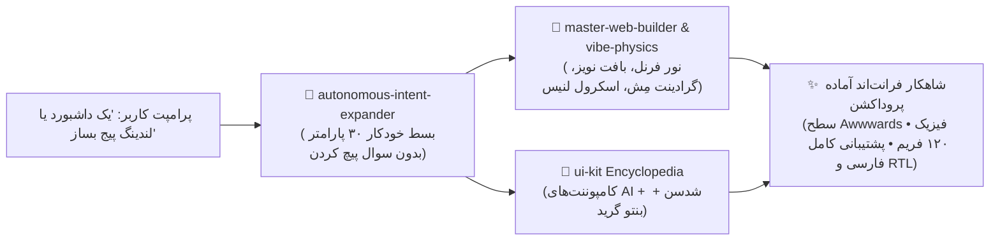

<div align="center">

# ✨ سوئیت مهارت‌های طراحی مدرن و Vibe UI برای ایجنت‌های هوش مصنوعی
### *تبدیل دستیار هوش مصنوعی شما به یک معمار ارشد و خلاق فرانت‌اند (سطح Awwwards)*

<p align="center">
  <a href="README.md"><b>English</b></a> •
  <a href="README.fa.md"><b>فارسی</b></a>
</p>

[](https://omid-io.github.io/vibe-ui-skills/showcase/)
[](LICENSE)
[](#-آداپتورهای-آماده-برای-محیط‌های-ai)
[](PROMPTS.fa.md)
[](#-جعبه‌ابزار-مهارت‌های-اصلی)
[](#1--master-web-builder)

<p align="center">
  <b>به خروجی‌های تکراری و کلیشه‌ای هوش مصنوعی پایان دهید.</b><br>
  مجموعه‌ای از مهارت‌های بدون وابستگی خارجی که فیزیک حرکتی پیشرفته، بیش از ۷۰ کامپوننت نیتیو مدرن و هوش مصنوعی، پشتیبانی کامل از زبان فارسی و راست‌چین (RTL)، و کپی‌رایتینگ متقاعدکننده را به تمام خروجی‌های وب تزریق می‌کند.<br><br>
  👉 <a href="https://omid-io.github.io/vibe-ui-skills/showcase/"><b>مشاهده دموی زنده و تغییر آنی تم‌ها</b></a>
</p>

---

</div>

<p align="center">
  
</p>

## 🛑 مسئله اصلی: خروجی‌های کلیشه‌ای هوش مصنوعی (AI UI Slop)

به صورت پیش‌فرض، اکثر مدل‌های زبانی (Claude، GPT-4o، Gemini) هنگام درخواست طراحی وبسایت خروجی‌های بی‌روح و تکراری تولید می‌کنند:
- ❌ کارت‌های یکنواخت با گوشه‌های ساده و بوردرهای خاکستری مات.
- ❌ دکمه‌های بنفش-آبی کلیشه‌ای در تمام پروژه‌ها.
- ❌ عدم پشتیبانی از وضعیت‌های زنده هوش مصنوعی (حالت تفکر، تراشه‌های ابزار، دیف استریم).
- ❌ چیدمان‌های بدون عمق بصری، نورپردازی و فیزیک حرکتی.

## 💎 راهکار: سوئیت Vibe UI

این ریپازیتوری به هوش مصنوعی شما یک استخوان‌بندی بصری مستحکم و دایرةالمعارفی از ۷۰+ کامپوننت مدرن با پشتیبانی ۱۰۰٪ از راست‌چین (RTL) و فونت‌های فارسی اضافه می‌کند.

<p align="center">
  
</p>



---

## 📦 جعبه‌ابزار مهارت‌های اصلی

| مهارت | دسته‌بندی | توضیح عملکرد | قابلیت‌های کلیدی |
| :--- | :--- | :--- | :--- |
| **👑 [`master-web-builder`](skills/master-web-builder/)** | معماری بصری | موتور استایل‌دهی سطح Awwwards با ۵ تم مستر. | بافت نویز SVG، گرادینت مِش محیطی، گلس‌مورفیسم ۲.۰ با نور فرنل، اسلایدر قبل/بعد ۱۲۰ فریم، دکمه‌های مغناطیسی. |
| **🎨 [`ui-kit`](skills/ui-kit/)** | سیستم کامپوننت | ۷۰+ کامپوننت آماده پروداکشن. | **۲۰ کامپوننت هوش مصنوعی** (حالت تفکر، تراشه‌های ابزار، کارت تایید، استریم)، **۵۰+ کامپوننت Shadcn**، **بنتو گرید** و ترنزیشن‌های خالص CSS. |
| **⚡ [`vibe-physics-engine`](skills/vibe-physics-engine/)** | فیزیک و رنگ | حرکت نرم و علم رنگ پیشرفته. | تئوری رنگ OKLCH، اسکرول روان Lenis، رندر گرافیکی لایه‌ها در GPU، حذف کامل ایموجی و جایگزینی با وکتورهای SVG. |
| **✍️ [`conversion-copy-engine`](skills/conversion-copy-engine/)** | کپی‌رایتینگ و CRO | متن‌های متقاعدکننده و افزایش نرخ تبدیل. | فرمول هدلاین جذاب، ساختار PAS (مسئله-تحریک-راهکار)، میکروکپی‌های رفع تردید، فانل‌های چت مستقیم و واتساپ. |
| **🧠 [`autonomous-intent-expander`](skills/autonomous-intent-expander/)** | درک هوشمند پرامپت | بسط خودکار پرامپت‌های کوتاه به سند فنی. | تبدیل پرامپت‌های چند کلمه‌ای به ۳۰ پارامتر کامل معماری، روانشناسی و دیزاین سیستم بدون نیاز به پرسش از کاربر. |

---

## 📐 معماری راست‌چین‌سازی محتوا-محور و ساختار ثابت (Content-Only RTL)

یکی از وجوه تمایز بنیادین Vibe UI، پایبندی به استاندارد **ساختار ثابت بین‌المللی** است:
- ❌ **اشتباه رایج هوش مصنوعی‌های معمولی:** معکوس کردن کل ساختار صفحه، جابجا شدن ستون‌های گرید، پرش منوها و تغییر مکان دکمه‌ها هنگام سوییچ به فارسی.
- ✅ **استاندارد Vibe UI:** اسکلت، گریدها، ترتیب کارت‌ها و منوها **کاملاً ثابت و بدون پرش** باقی می‌مانند. جهت RTL تنها بر روی متون و پاراگراف‌ها اعمال شده، اصطلاحات انگلیسی دچار به‌هم‌ریختگی نمی‌شوند، و بخش‌های کد، اعداد و متریک‌ها همواره در حالت اصیل LTR مونو باقی می‌مانند.

---

## 🚀 روش‌های نصب سریع

### 🤖 روش ۰: نصب خودکار با یک پرامپت به هوش مصنوعی (بدون نیاز به کد و ترمینال)

ساده‌ترین روش ممکن! کافیست متن پرامپت زیر را کپی کرده و مستقیماً به هوش مصنوعی خود (**Google Antigravity، Cursor Composer، Claude Code، GitHub Copilot یا Windsurf**) بدهید:

> **متن پرامپت را کپی کرده و به هوش مصنوعی بدهید:**
> ```text
> لطفاً سوئیت اسکیل‌های Vibe UI را از ریپازیتوری https://github.com/omid-io/vibe-ui-skills در محیط فعال هوش مصنوعی من (پوشه skills یا تنظیمات پروژه) نصب و مستقر کن و مطمئن شو اسکیل‌های master-web-builder و ui-kit آماده استفاده هستند.
> ```

---

### روش ۱: نصب ۱-خطی از طریق ترمینال ویندوز (PowerShell)

```powershell
irm https://raw.githubusercontent.com/omid-io/vibe-ui-skills/main/install.ps1 | iex
```

### روش ۲: نصب ۱-خطی در مک و لینوکس (Bash)

```bash
curl -fsSL https://raw.githubusercontent.com/omid-io/vibe-ui-skills/main/install.sh | bash
```

### روش ۳: کلون مستقیم در پوشه اسکیل‌های ایجنت

برای **Google Antigravity**:
```bash
git clone https://github.com/omid-io/vibe-ui-skills.git %USERPROFILE%\.gemini\config\skills\vibe-ui-skills-repo
```

---

## 🔌 آداپتورهای آماده برای محیط‌های AI

فایل‌های قوانین آماده برای تمامی ابزارهای برتر برنامه‌نویسی با هوش مصنوعی در پوشه [`adapters/`](adapters/) قرار دارد:

| ابزار هوش مصنوعی | فایل کانفیگ | نحوه استفاده |
| :--- | :--- | :--- |
| **Cursor** | [`adapters/cursor/.cursorrules`](adapters/cursor/.cursorrules) | کپی به ریشه پروژه به عنوان `.cursorrules` |
| **Claude Code** | [`adapters/claude/CLAUDE.md`](adapters/claude/CLAUDE.md) | کپی به ریشه پروژه به عنوان `CLAUDE.md` |
| **GitHub Copilot** | [`adapters/copilot/copilot-instructions.md`](adapters/copilot/copilot-instructions.md) | کپی به `.github/copilot-instructions.md` |
| **Windsurf / Cascade** | [`adapters/windsurf/.windsurfrules`](adapters/windsurf/.windsurfrules) | کپی به ریشه پروژه به عنوان `.windsurfrules` |

---

## 🎨 ۵ سبک بصری مستر (۵ زبان طراحی مجزا)

1. **⚡ مینیمال مهندسی و دارک SaaS (استایل Linear / Vercel):** پس‌زمینه مشکی خالص، بوردرهای ۱ پیکسلی تیز، گرادینت ملایم جهت‌دار، فونت منواسپیس برای داده‌ها.
2. **💎 آبسیدین لوکس و گلس‌مورفیسم ۲.۰:** پس‌زمینه مخمل تیره، نویز ظریف، نور انعکاسی فرنل (Fresnel Specular Inset).
3. **🎨 نئوبروتالیسم (استایل Gumroad / Figma):** رنگ‌های شاداب پاستلی، خطوط ضخیم ۲ پیکسلی مشکی، سایه‌های سخت ۴ پیکسلی، کلیک‌های فیزیکی دکمه‌ها.
4. **📰 ادیتوریال سوئیسی و Paper Craft:** رنگ کاغذ طبیعی کرم، تیترهای سریف باکلاس، چیدمان نامتقارن مجله‌ای.
5. **☀️ لایت شفاف و مدرن (استایل Stripe / Apple):** سفید برفی، سایه‌های نرم پخش‌شده چندمرحله‌ای، کنتراست بالای دسترسی‌پذیری.

---

## 🇮🇷 پشتیبانی بومی از زبان فارسی و راست‌چین (RTL)

- استفاده خودکار از ویژگی‌های منطقی CSS (`ms-*`, `me-*`, `start-*`, `end-*`) جهت تطبیق کامل بدون باگ با جهت `dir="rtl"`.
- پشته فونت‌های استاندارد فارسی شامل **وزیرمتن (Vazirmatn)**، **ایران‌یکان / یکان‌بخ (Yekan Bakh)** و **شبنم (Shabnam)**.
- نمونه پرامپت‌ها و ساختار کپی‌رایتینگ بهینه‌سازی‌شده برای مخاطبان فارسی‌زبان در فایل [`PROMPTS.fa.md`](PROMPTS.fa.md).

---

## 🎯 کتابچه ۳۰ فرمول پرامپت طلایی

برای مشاهده فرمول‌های پرامپت آماده فارسی به تفکیک حوزه‌ها (داشبورد، ایجنت، فروشگاهی، خدمات)، به فایل **[`PROMPTS.fa.md`](PROMPTS.fa.md)** مراجعه کنید.

---

## 👤 سازنده و توسعه‌دهنده

**امید ظفری (Omid Zaferi)**
- گیت‌هاب: [@omid-io](https://github.com/omid-io)
- معمار سیستم‌های نرم‌افزاری و ایجنت‌های خودکار هوش مصنوعی

## 📄 لایسنس

این پروژه تحت لایسنس متن‌باز MIT منتشر شده است — فایل [LICENSE](LICENSE) را مشاهده کنید.
