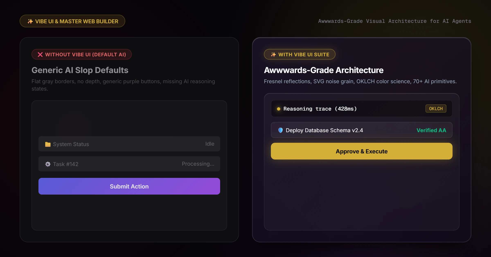
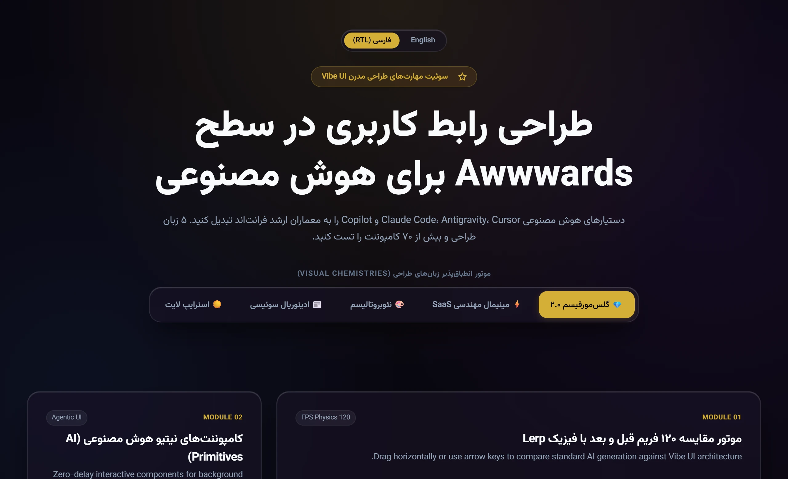
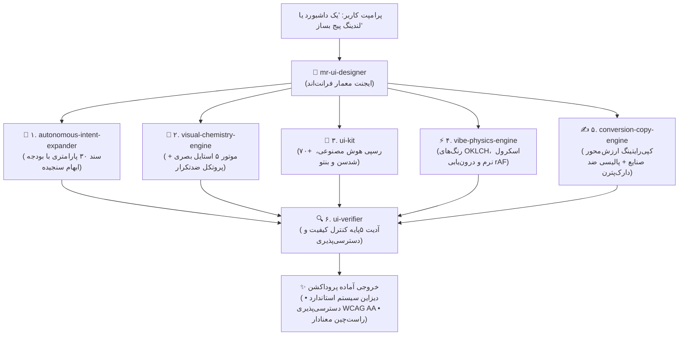

<div align="center">

# سوئیت مهارت‌های Vibe UI (`mr-ui-designer`)
### *قراردادهای قطعی رابط کاربری و هوش طراحی برای دستیارهای برنامه‌نویسی هوش مصنوعی*

<p align="center">
  <a href="README.md"><b>English</b></a> •
  <a href="README.fa.md"><b>فارسی</b></a>
</p>

[](ARCHITECTURE.md)
[](https://github.com/omid-io/vibe-ui-skills/actions)
[](https://omid-io.github.io/vibe-ui-skills/showcase/)
[](SECURITY.md)
[](LICENSE)
[](#-آداپتورهای-آماده-برای-محیط‌های-ai)
[](evals/README.md)
[](CHANGELOG.md)

<p align="center">
  <b>قراردادهای قطعی و گیت‌های کنترل کیفی فرانت‌اند برای ایجنت‌های هوش مصنوعی.</b><br>
  <b><code>mr-ui-designer</code></b> یک ایجنت معمار فرانت‌اند است که خط لوله‌ای از ۶ مهارت تخصصی طراحی، فیزیک و اعتبارسنجی را هدایت می‌کند تا اسکیماهای ماشین‌خوان دیزاین، توکن‌های تایپ‌شده OKLCH، اعتبارسنجی ریاضی کنتراست WCAG 2.2 AA، و راست‌چین پایدار ساختار-ثابت (Semantic RTL) را در محیط‌های Cursor، Claude Code، Windsurf و Antigravity مستقر سازد.<br><br>
  👉 <a href="https://omid-io.github.io/vibe-ui-skills/showcase/"><b>مشاهده دموی زنده و تغییر آنی تم‌ها</b></a>
</p>

---

</div>

<p align="center">
  
</p>

## 🛑 مسئله اصلی: خروجی‌های تکراری و انحراف کیفی هوش مصنوعی

مدل‌های زبانی بزرگ (LLMs) به طور پیش‌فرض کدهای رابط کاربری تولید می‌کنند که استانداردهای وب تجاری و دسترسی‌پذیری را نقض می‌کنند:
- ❌ **کنتراست نسنجیده رنگ‌ها:** استفاده از ترکیب رنگ‌های تصادفی که معیارهای WCAG 2.2 AA را نقض می‌کنند (کنتراست کمتر از ۴.۵:۱ در متون بدنه و کمتر از ۳.۰:۱ در عناوین).
- ❌ **کارت‌ها و استایل‌های کلیشه‌ای:** کارت‌های یکنواخت با گوشه‌های تکراری، بوردرهای خاکستری بدون عمق و گرادینت‌های خطی تکراری بنفش-آبی روی دکمه‌ها.
- ❌ **فقدان وضعیت‌های زنده هوش مصنوعی:** نبود کامل دراور بازشونده تفکر (Thinking Drawer)، تراشه‌های اجرای ابزار (Tool Chips)، استریم توکن‌ها و دیالوگ‌های تایید انسانی.
- ❌ **شکست در ویوپورت موبایل:** گریدها و المان‌های بدون انعطاف که باعث سرریز افقی (> 0px blowout) در ویوپورت‌های ۳۷۵ پیکسلی می‌شوند.
- ❌ **تخریب ساختار در زبان‌های راست‌چین:** وارونه‌سازی ناآگاهانه کل اسکلت صفحه و ستون‌های گرید به جای اعمال جهت صرفاً بر متون خواندنی.
- ❌ **سربار پردازش رندر گرافیکی:** استفاده نامحدود از فیلترهای بلور (`backdrop-filter`) که باعث افت شدید نرخ فریم در دستگاه‌های موبایل می‌شود.

## 🤖 راهکار: mr-ui-designer (ایجنت معمار فرانت‌اند)

به جای تکیه بر پرامپت‌های ناپایدار و سلیقه‌ای، **`mr-ui-designer`** به عنوان یک **معمار ارشد فرانت‌اند** عمل می‌کند. هر زمان که طراحی یا پیاده‌سازی رابط کاربری را درخواست کنید، خط لوله‌ای شامل **۶ مهارت تخصصی** را هدایت می‌کند:

<p align="center">
  
</p>



---

## ⚡ راه‌اندازی ۳۰ ثانیه‌ای در محیط‌های مختلف (Multi-IDE Setup)

قراردادهای قطعی رابط کاربری را بدون وابستگی خارجی در ۳۰ ثانیه به محیط هوش مصنوعی خود متصل کنید:

### ۱. بارگذاری آداپتور متناسب با ادیتور شما

* **محیط Cursor IDE:**
  ```bash
  cp adapters/cursor/.cursorrules .cursorrules
  # یا کپی در دایرکتوری .cursor/rules/
  ```
* **محیط Claude Code (`CLAUDE.md`):**
  ```bash
  # برای پروژه‌های جدید:
  cp adapters/claude/CLAUDE.md CLAUDE.md
  # یا الصاق بدون تخریب به دستورالعمل‌های موجود:
  cat adapters/claude/CLAUDE.md >> CLAUDE.md
  ```
* **محیط Windsurf IDE:**
  ```bash
  cp adapters/windsurf/.windsurfrules .windsurfrules
  ```
* **محیط Google Antigravity / Gemini CLI (`~/.gemini/config/skills/`):**
  ```powershell
  # ویندوز (PowerShell):
  powershell -ExecutionPolicy Bypass -Command "irm https://raw.githubusercontent.com/omid-io/vibe-ui-skills/main/install.ps1 | iex"
  # مک / لینوکس (Bash):
  curl -fsSL https://raw.githubusercontent.com/omid-io/vibe-ui-skills/main/install.sh | bash
  ```

### ۲. درخواست طراحی از `mr-ui-designer`
نیازمندی رابط کاربری خود را مستقیماً از دستیار هوش مصنوعی بخواهید:
> *"یک داشبورد تله‌متری و تحلیل داده با سبک مینیمال SaaS، دراور آکاردئونی وضعیت تفکر هوش مصنوعی، اعداد مونو و تم رنگی پایدار OKLCH طراحی کن."*

### ۳. اعتبارسنجی کیفیت با آزمون‌های خودکار
کد تولیدشده را با ابزار ارزیابی خودکار پروژه بسنجید:
```bash
python evals/run_evals.py
```
موارد مورد سنجش در این آزمون:
- **کنتراست ریاضی WCAG 2.2 AA:** نسبت کنتراست $\ge 4.5:1$ در متون بدنه و $\ge 3.0:1$ در تیترها.
- **ریسپانسیو موبایل:** عدم سرریز افقی (0px overflow) در صفحات ۳۷۵ پیکسلی.
- **سقف پردازش گرافیکی:** حداکثر ۳ لایه فیلتر بلور در صفحه.
- **پایداری فیزیک حرکتی:** محاسبات مستقل از رفرش‌ریت ($\alpha = 1 - e^{-\lambda \cdot \Delta t}, \lambda = 14$).
- **راست‌چین‌سازی ساختار-ثابت:** ثبات ساختار کلان گرید، ایزولاسیون اصطلاحات انگلیسی با `<bdi>` و حفظ کدها به صورت LTR مونو.
- **استارتر پروداکشن:** اعتبارسنجی معماری Next.js 15، توکن‌های تایپ‌شده OKLCH و کامپوننت‌های React 19.

---

<a id="-جعبه‌ابزار-مهارت‌های-زیردست"></a>
<a id="-جعبه‌ابزار-مهارت‌های-زیردست-تحت-فرماندهی-mr-ui-designer"></a>
## 📦 جعبه‌ابزار مهارت‌های زیردست (تحت فرماندهی mr-ui-designer)

| مهارت | دسته‌بندی | توضیح عملکرد | قابلیت‌های کلیدی |
| :--- | :--- | :--- | :--- |
| **🎨 [`visual-chemistry-engine`](skills/visual-chemistry-engine/)** | معماری بصری | موتور طراحی بصری تطبیقی با ۵ شیمی استایل متمایز. | بافت نویز SVG، گرادینت مِش محیطی، گلس‌مورفیسم ۲.۰ با نور فرنل، پروتکل ضدتکرار، اسلایدر قبل/بعد با درون‌یابی مستقل از زمان، دکمه‌های مغناطیسی. |
| **🧩 [`ui-kit`](skills/ui-kit/)** | سیستم کامپوننت | ۷۰+ رسپی و کامپوننت آماده AI. | **۲۰ کامپوننت هوش مصنوعی** (حالت تفکر، تراشه‌های ابزار، کارت تایید، استریم)، **۵۰+ کامپوننت Shadcn**، **بنتو گرید**، نودهای گردش‌کار و ترنزیشن‌های خالص CSS. |
| **⚡ [`vibe-physics-engine`](skills/vibe-physics-engine/)** | فیزیک و رنگ | حرکت نرم و علم رنگ پیشرفته. | تئوری رنگ OKLCH چندزبانه، اسکرول نرم کاملاً نیتیو بدون وابستگی + لنیس مدرن اختیاری، انیمیشن‌های وابسته به رفرش‌ریت، حذف کامل ایموجی با SVG. |
| **✍️ [`conversion-copy-engine`](skills/conversion-copy-engine/)** | کپی‌رایتینگ ارزش‌محور | معماری متون ترغیبی و تبدیل بدون دارک‌پترن. | فرمول‌های تخصصی صنایع (B2B JTBD/ROI، پزشکی، لوکس)، هدلاین‌های ارزش‌محور، میکروکپی‌های رفع تردید، پالیسی ضد دارک‌پترن. |
| **🧠 [`autonomous-intent-expander`](skills/autonomous-intent-expander/)** | سنتز مشخصات فنی | کامپایلر قصد کاربر و مشخصات ۳۰ پارامتری. | تبدیل پرامپت‌های کوتاه به ۳۰ پارامتر کامل دیزاین و معماری با بودجه ابهام سنجیده (Ambiguity Budget). |
| **🔍 [`ui-verifier`](skills/ui-verifier/)** | ارزیابی کیفیت و آدیت | آدیتور خودکار فرانت با چک‌لیست ۵‌گانه. | دسترسی‌پذیری WCAG 2.2 AA، تست ریسپانسیو (۳۷۵/۷۶۸/۱۴۴۰)، سنجش اصالت بصری و ضداسلوپ، بهینگی رندر GPU، پایداری BiDi و متن فارسی. |

---

## 📐 معماری راست‌چین‌سازی ساختار-ثابت و معنادار (Semantic RTL)

یکی از وجوه تمایز بنیادین Vibe UI، پایبندی به استاندارد **ساختار ثابت بین‌المللی در کنار میرور معنایی** است:
- ❌ **اشتباه رایج هوش مصنوعی‌های معمولی:** معکوس کردن کل ساختار صفحه، جابجا شدن ستون‌های گرید، پرش منوها و تغییر مکان دکمه‌ها هنگام سوییچ به فارسی.
- ✅ **استاندارد Vibe UI:** اسکلت کلان، گریدها، ترتیب کارت‌ها و منوها **کاملاً ثابت و بدون پرش** باقی می‌مانند. جهت RTL تنها بر روی متون و پاراگراف‌ها اعمال شده، المان‌های ذاتاً جهت‌دار (مثل فلش‌های بعدی/قبلی و استپرها) به شکل معنادار قرینه می‌شوند، اصطلاحات انگلیسی دچار به‌هم‌ریختگی نمی‌شوند، و بخش‌های کد، اعداد و متریک‌ها همواره در حالت اصیل LTR مونو باقی می‌مانند.

---

## 🚀 روش‌های نصب سریع

### 🤖 روش ۰: نصب خودکار با یک پرامپت به هوش مصنوعی (بدون نیاز به کد و ترمینال)

ساده‌ترین روش ممکن! کافیست متن پرامپت زیر را کپی کرده و مستقیماً به هوش مصنوعی خود (**Google Antigravity، Cursor Composer، Claude Code، GitHub Copilot یا Windsurf**) بدهید:

> **متن پرامپت را کپی کرده و به هوش مصنوعی بدهید:**
> ```text
> لطفاً سوئیت اسکیل‌های Vibe UI را از ریپازیتوری https://github.com/omid-io/vibe-ui-skills در محیط فعال هوش مصنوعی من (پوشه skills یا تنظیمات پروژه) نصب و مستقر کن و مطمئن شو اسکیل‌های visual-chemistry-engine، ui-kit و ui-verifier آماده استفاده هستند.
> ```

---

### روش ۱: نصب ۱-خطی از طریق ترمینال ویندوز (PowerShell)

```powershell
powershell -ExecutionPolicy Bypass -Command "irm https://raw.githubusercontent.com/omid-io/vibe-ui-skills/main/install.ps1 | iex"
```

*یا اجرای محلی در پاورشل:*
```powershell
git clone https://github.com/omid-io/vibe-ui-skills.git
cd vibe-ui-skills
powershell -ExecutionPolicy Bypass -File .\install.ps1
```

### روش ۲: نصب ۱-خطی در مک و لینوکس (Bash)

```bash
curl -fsSL https://raw.githubusercontent.com/omid-io/vibe-ui-skills/main/install.sh | bash
```

### روش ۳: کلون مخزن و اجرای محلی اسکریپت نصب

**در ویندوز (PowerShell):**
```powershell
git clone https://github.com/omid-io/vibe-ui-skills.git
cd vibe-ui-skills
powershell -ExecutionPolicy Bypass -File .\install.ps1
```

**در مک و لینوکس (Bash):**
```bash
git clone https://github.com/omid-io/vibe-ui-skills.git
cd vibe-ui-skills
chmod +x ./install.sh
./install.sh
```

---

<a id="-آداپتورهای-آماده-برای-محیط‌های-ai"></a>
## 🔌 آداپتورهای آماده برای محیط‌های AI

فایل‌های قوانین آماده برای تمامی ابزارهای برتر برنامه‌نویسی با هوش مصنوعی در پوشه [`adapters/`](adapters/) قرار دارد:

| ابزار هوش مصنوعی | فایل کانفیگ | نحوه استفاده |
| :--- | :--- | :--- |
| **Cursor** | [`adapters/cursor/.cursorrules`](adapters/cursor/.cursorrules) | کپی به ریشه پروژه به عنوان `.cursorrules` |
| **Claude Code** | [`adapters/claude/CLAUDE.md`](adapters/claude/CLAUDE.md) | کپی به ریشه پروژه به عنوان `CLAUDE.md` |
| **GitHub Copilot** | [`adapters/copilot/copilot-instructions.md`](adapters/copilot/copilot-instructions.md) | کپی به `.github/copilot-instructions.md` |
| **Windsurf / Cascade** | [`adapters/windsurf/.windsurfrules`](adapters/windsurf/.windsurfrules) | کپی به ریشه پروژه به عنوان `.windsurfrules` |

---

## 🎨 ۵ سبک بصری مستر (۵ زبان طراحی مجزا)

1. **⚡ مینیمال مهندسی و دارک SaaS (استایل Linear / Vercel):** پس‌زمینه مشکی خالص، بوردرهای ۱ پیکسلی تیز، گرادینت ملایم جهت‌دار، فونت منواسپیس برای داده‌ها.
2. **💎 آبسیدین لوکس و گلس‌مورفیسم ۲.۰:** پس‌زمینه مخمل تیره، نویز ظریف، نور انعکاسی فرنل (Fresnel Specular Inset).
3. **🎨 نئوبروتالیسم (استایل Gumroad / Figma):** رنگ‌های شاداب پاستلی، خطوط ضخیم ۲ پیکسلی مشکی، سایه‌های سخت ۴ پیکسلی، کلیک‌های فیزیکی دکمه‌ها.
4. **📰 ادیتوریال سوئیسی و Paper Craft:** رنگ کاغذ طبیعی کرم، تیترهای سریف باکلاس، چیدمان نامتقارن مجله‌ای.
5. **☀️ لایت شفاف و مدرن (استایل Stripe / Apple):** سفید برفی، سایه‌های نرم پخش‌شده چندمرحله‌ای، کنتراست بالای دسترسی‌پذیری.

---

## 🇮🇷 پشتیبانی بومی از زبان فارسی و راست‌چین (RTL)

- استفاده خودکار از ویژگی‌های منطقی CSS (`ms-*`, `me-*`, `start-*`, `end-*`) جهت تطبیق کامل بدون باگ با جهت `dir="rtl"`.
- پشته فونت‌های استاندارد فارسی شامل **وزیرمتن (Vazirmatn)**، **ایران‌یکان / یکان‌بخ (Yekan Bakh)** و **شبنم (Shabnam)**.
- نمونه پرامپت‌ها و ساختار کپی‌رایتینگ بهینه‌سازی‌شده برای مخاطبان فارسی‌زبان در فایل [`PROMPTS.fa.md`](PROMPTS.fa.md).

---

## 🎯 کتابچه ۳۰ فرمول پرامپت طلایی

برای مشاهده فرمول‌های پرامپت آماده فارسی به تفکیک حوزه‌ها (داشبورد، ایجنت، فروشگاهی، خدمات)، به فایل **[`PROMPTS.fa.md`](PROMPTS.fa.md)** مراجعه کنید.

---

## 🧪 مجموعه بنچمارک‌های ارزیابی و نمونه‌های واقعی خروجی

برخلاف کالکشن‌های متنی که فقط ادعای کیفی دارند، این مخزن شامل یک **مجموعه رسمی ارزیابی ([`evals/`](evals/))**، **اسکیمای رسمی داده‌ها ([`schemas/design-spec.v1.schema.json`](schemas/design-spec.v1.schema.json))** و **نمونه‌های واقعی خروجی ایجنت ([`examples/`](examples/))** است:

- **[`schemas/`](schemas/)**: ساختار داده‌ای استاندارد JSON Schema ([`schemas/design-spec.v1.schema.json`](schemas/design-spec.v1.schema.json)) برای اعتبارسنجی ماشینی مشخصات خروجی `autonomous-intent-expander`.
- **[`evals/`](evals/)**: اسکریپت رانر خودکار ([`evals/run_evals.py`](evals/run_evals.py)) و سناریوهای بنچمارک همراه با شروط قبولی عینی.
- **[`examples/`](examples/)**: فایل‌های HTML/CSS مستقل و آماده پیش‌نمایش در مرورگر *(از CDN تیل‌ویند برای باز شدن سریع در مرورگر استفاده شده؛ برای نسخه‌های تجاری پروداکشن، خروجی با Tailwind CLI کامپایل می‌شود)*:
  - [`examples/saas_ai_hero.html`](examples/saas_ai_hero.html): هیرو بخش SaaS با وضعیت تفکر هوش مصنوعی و تراشه اجرای ابزار.
  - [`examples/persian_rtl_bento.html`](examples/persian_rtl_bento.html): بنتو گرید فارسی با فونت وزیرمتن، چیدمان ثابت و ایزولاسیون علائم نگارشی انگلیسی.
  - [`examples/neobrutalist_creative_store.html`](examples/neobrutalist_creative_store.html): لندینگ پیج نئوبروتالیسم با کنتراست بالا، سایه‌های سخت و بازخورد فیزیکی کلیک‌ها.
  - [`examples/swiss_editorial_article.html`](examples/swiss_editorial_article.html): چیدمان ادیتوریال سوئیسی با فونت سریف روی بوم کاغذ طبیعی و بدون هیچ‌گونه بلور تزئینی.
- **`examples/nextjs-starter/`**: استارتر آماده پروداکشن Next.js 15 App Router و React 19 شامل تایپ‌اسکریپت، توکن‌های تایپ‌شده OKLCH، کامپوننت‌های نیتیو هوش مصنوعی (`AiThinkingDrawer.tsx` و `HeroSection.tsx`) و پشتیبانی پایدار از راست‌چین ساختار-ثابت.

---

## ⚡ استارتر مدرن پروداکشن (Next.js 15 و React 19)

برای پروژه‌های فول‌استک تجاری، یک پروژه استارتر آماده در مسیر `examples/nextjs-starter/` پیاده‌سازی شده است:
- **هسته فریم‌ورک:** Next.js 15 App Router (`next: ^15.1.7`)، React 19 (`react: ^19.0.0`) و TypeScript 5.
- **توکن‌های تایپ‌شده OKLCH:** فایل `lib/tokens.ts` شامل پالت‌های رنگی ۵ سبک بصری مستر.
- **کامپوننت‌های مدرن هوش مصنوعی:**
  - `AiThinkingDrawer.tsx`: دراور آکاردئونی روان با CSS Grid (`0fr` به `1fr`)، نواحی زنده ARIA، پالس رادار و تراشه‌های اجرای ابزار.
  - `HeroSection.tsx`: بخش هیرو لندینگ همراه با کپی‌رایتینگ ترغیبی، دراور تعبیه‌شده و ویجت تله‌متری با استایل `.ltr-code`.
- **راست‌چین‌سازی معنادار ساختار-ثابت:** سازگاری کامل دوطرفه با پراپرتی‌های منطقی CSS، ایزولاسیون واژگان انگلیسی با `<bdi>` و حفظ مختصات کلان گرید.

برای مطالعه کامل سند فنی معماری، قراردادهای اسکیمای JSON و تحلیل ۳۰ پارامتر طراحی، به سند **[`ARCHITECTURE.md`](ARCHITECTURE.md)** مراجعه کنید.

---

## 👤 سازنده و توسعه‌دهنده

**امید ظفری (Omid Zaferi)**
- گیت‌هاب: [@omid-io](https://github.com/omid-io)
- معمار سیستم‌های نرم‌افزاری و ایجنت‌های خودکار هوش مصنوعی

## 📄 لایسنس

این پروژه تحت لایسنس متن‌باز MIT منتشر شده است — فایل [LICENSE](LICENSE) را مشاهده کنید.
