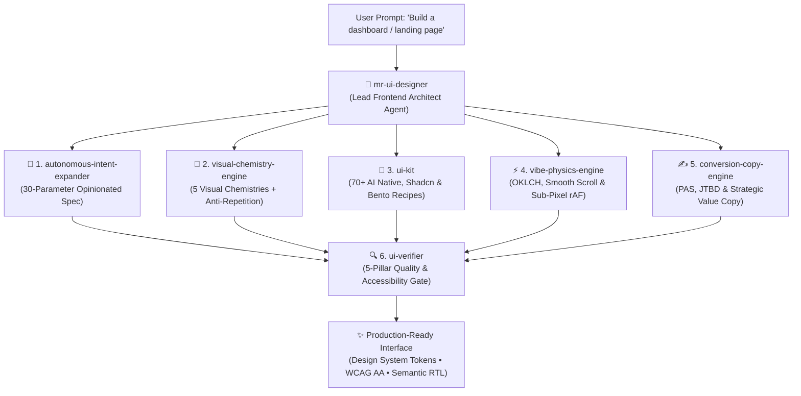

<div align="center">
  

# Vibe UI Suite (`mr-ui-designer`)
### *Deterministic UI Contracts & Component Intelligence for AI Coding Assistants*

<p align="center">
  <a href="README.md"><b>English</b></a> •
  <a href="README.fa.md"><b>فارسی</b></a>
</p>

[](https://open-vsx.org/extension/omid-io/vibe-ui-vscode)
[](https://marketplace.visualstudio.com/items?itemName=omid-io.vibe-ui-vscode)
[](https://www.npmjs.com/package/@omid-io/tokens)
[](ARCHITECTURE.md)
[](https://github.com/omid-io/vibe-ui-skills/actions)
[](https://omid-io.github.io/vibe-ui-skills/showcase/)
[](SECURITY.md)
[](LICENSE)
[](#-universal-ide-adapters)
[](evals/README.md)
[](CHANGELOG.md)

<p align="center">
  <b>Deterministic design contracts and evaluation gates for AI coding agents.</b><br>
  <b><code>mr-ui-designer</code></b> coordinates a modular pipeline of 6 specialized design, physics, and verification skills—enforcing machine-readable JSON design specs, typed OKLCH tokens, mathematical WCAG AA contrast validation, and fixed-structure semantic RTL into Cursor, Claude Code, Windsurf, and Antigravity workflows.<br><br>
  👉 <a href="https://omid-io.github.io/vibe-ui-skills/showcase/"><b>Explore the Live Interactive Showcase & Theme Switcher</b></a>
</p>

---

</div>

<p align="center">
  
</p>

## 🛑 The Problem: Generic AI Interface Outputs & Visual Drift

By default, frontier LLMs generate repetitive, uncalibrated interface code that frequently violates production engineering standards:
- ❌ **Unverified Contrast Ratios:** Unchecked color pairs that fail WCAG 2.2 AA accessibility standards (< 4.5:1 for body copy, < 3:1 for headings).
- ❌ **Monotonous Structural Clichés:** Predictable `border-radius: 8px` cards with flat gray borders and generic purple-to-blue linear gradients on buttons.
- ❌ **Missing AI Execution States:** Complete absence of collapsible reasoning drawers, tool execution chips, streaming token cursors, and human-in-the-loop approval cards.
- ❌ **Mobile Viewport Breakage:** Rigid layout grids that cause horizontal overflow (> 0px blowout) on 375px mobile viewports.
- ❌ **Fragile RTL Layout Inversions:** Naive horizontal flipping of entire macro column grids and navigation structures instead of scoping directionality strictly to readable text nodes.
- ❌ **Uncapped Compositing Cost:** Excessive, unconstrained stacking of `backdrop-filter` blur layers that exhausts GPU fill-rate.

## 🤖 The Solution: mr-ui-designer (Lead Frontend Architect Agent)

Instead of relying on fragile, unstructured prompt engineering, **`mr-ui-designer`** operates as a specialized **Lead Frontend Architect**. When tasked with designing or implementing an interface, it autonomously coordinates a pipeline of **6 specialized sub-skills**:

<p align="center">
  
</p>



---

## ⚡ 30-Second Setup: Multi-IDE Quick Start

Get deterministic UI contracts running in your AI coding assistant in 30 seconds with zero runtime dependencies:

### 1. Configure Your IDE / Agent

Choose your environment and load the pre-configured adapter:

* **Cursor IDE:**
  ```bash
  # Copy into your repository root or .cursor/rules/ directory
  cp adapters/cursor/.cursorrules .cursorrules
  ```
* **Claude Code (`CLAUDE.md`):**
  ```bash
  # For new workspaces:
  cp adapters/claude/CLAUDE.md CLAUDE.md
  # Or safely append to existing workspace instructions:
  cat adapters/claude/CLAUDE.md >> CLAUDE.md
  ```
* **Windsurf IDE:**
  ```bash
  # Copy into your Windsurf workspace root
  cp adapters/windsurf/.windsurfrules .windsurfrules
  ```
* **Antigravity / Gemini CLI (`~/.gemini/config/skills/`):**
  ```bash
  # Recommended: Clone or copy directly into skills directory
  git clone https://github.com/omid-io/vibe-ui-skills.git ~/.gemini/config/skills/vibe-ui-skills
  
  # Or via automated installer:
  # Windows (PowerShell):
  powershell -ExecutionPolicy Bypass -Command "irm https://raw.githubusercontent.com/omid-io/vibe-ui-skills/main/install.ps1 | iex"
  # Linux / macOS (Bash):
  curl -fsSL https://raw.githubusercontent.com/omid-io/vibe-ui-skills/main/install.sh | bash
  ```

### 2. Verify Your Setup (1-Minute Sanity Check)
Verify that your coding assistant is actively adhering to Vibe UI contracts:
> *"Generate a primary CTA button component with an icon."*

- **✅ PASS:** Emits typed OKLCH color variables (`oklch(...)`), an inline SVG icon, semantic `<button>`, and zero raw emojis.
- **❌ FAIL:** Emits raw unicode emojis (e.g. 🚀, ✨) or generic unverified hex colors (indicates rules file was not loaded).
- **Troubleshooting:**
  - **Cursor:** Ensure `.cursorrules` is at project root, or move to `.cursor/rules/vibe-ui.mdc`.
  - **Claude Code:** Confirm instructions were appended to `CLAUDE.md`.
  - **Windsurf:** Ensure `.windsurfrules` is located in your workspace root.

### 3. Prompt `mr-ui-designer`
Prompt your assistant to generate or refactor any interface component:
> *"Build a high-performance SaaS telemetry dashboard with an AI thinking drawer, metric cards with JetBrains Mono numbers, and a Minimalist SaaS theme with OKLCH tokens."*

### 4. Run Automated Verification
Audit the generated code against Vibe UI's deterministic engineering gates:
```bash
python evals/run_evals.py
```
This empirically verifies:
- **WCAG 2.2 AA Contrast:** $\ge 4.5:1$ (body text) and $\ge 3.0:1$ (headings).
- **Responsive Viewports:** 0px horizontal overflow on 375px mobile screens.
- **Compositing Budget:** $\le 3$ active `backdrop-filter` blur surfaces.
- **Physics Fidelity:** Frame-rate-independent deltaTime motion loop ($\alpha = 1 - e^{-\lambda \cdot \Delta t}, \lambda = 14$).
- **Semantic RTL Stability:** Physically fixed macro coordinates, `<bdi>` BiDi punctuation isolation, and pure LTR telemetry.
- **Production Starter:** Next.js 15 App Router architecture, typed OKLCH tokens, and React 19 AI primitives.

### 📚 70+ Component Recipe Index
All 70+ verified component recipes are cataloged with copy-paste code in [`skills/ui-kit/SKILL.md`](skills/ui-kit/SKILL.md):
- **AI-Native Primitives (20 Recipes):** Collapsible AI Thinking Drawers, Tool Execution Chips, Streaming Diffs, Approval Cards, Telemetry Badges.
- **Structural Layouts (15 Recipes):** Asymmetric Bento Grids, Fixed-Structure Semantic RTL Headers, Swiss Editorial Grids.
- **Interactive Controls (25 Recipes):** Before/After deltaTime Lerp Sliders, Magnetic Spring Buttons, Accessible Modals (`aria-modal`), Drawer Overlays.
- **Data & Telemetry (10 Recipes):** JetBrains Mono Metric Tiles, Sparkline Trend Cards, Status Pulse Indicators.

---

<a id="-the-6-sub-skills-arsenal-commanded-by-mr-ui-designer"></a>
<a id="the-6-sub-skills-arsenal-commanded-by-mr-ui-designer"></a>
## 📦 The 6 Sub-Skills Arsenal (Commanded by mr-ui-designer)

| Skill | Category | Description | Key Capabilities |
| :--- | :--- | :--- | :--- |
| **🎨 [`visual-chemistry-engine`](skills/visual-chemistry-engine/)** | Visual Architecture | Adaptive visual design engine across 5 distinct chemistries. | SVG Noise Overlay, Mesh Ambient Glow, Glassmorphism 2.0 (Fresnel Specular Highlights), Anti-Repetition Protocol, Frame-rate-independent Lerp Sliders, Magnetic Spring Buttons. |
| **🧩 [`ui-kit`](skills/ui-kit/)** | Component System | 70+ AI-ready UI component recipes. | **20 AI-Native Primitives** (Thinking state, Tool chips, Approval cards, Streaming diffs), **50+ Shadcn Primitives**, **Bento Grids**, and **Transitions.dev** zero-dep motion. |
| **⚡ [`vibe-physics-engine`](skills/vibe-physics-engine/)** | Physics & Motion | Smooth momentum and mathematical color. | OKLCH Multi-Chemistry color tokens, Zero-dep native smooth scroll + progressive modern Lenis, GPU layer compositing, Strict Zero-Emoji vector standard. |
| **✍️ [`conversion-copy-engine`](skills/conversion-copy-engine/)** | Value Copywriting | Domain-calibrated value propositions. | Multi-domain frameworks (B2B JTBD/ROI, Luxury Status, Healthcare Trust), Hero Headline formula, Objection inversion microcopy, Anti-Dark-Pattern policy. |
| **🧠 [`autonomous-intent-expander`](skills/autonomous-intent-expander/)** | Spec Expansion | Opinionated specification synthesizer. | Converts 1-sentence lazy prompts into a 30-parameter complete architectural, psychological, and visual specification with calibrated Ambiguity Budget. |
| **🔍 [`ui-verifier`](skills/ui-verifier/)** | Quality & Audit | 5-Pillar automated frontend auditor. | Full inspection of WCAG 2.2 AA Accessibility, Responsive Breakpoints (375/768/1440), Anti-Slop Visual Quality, Compositing Performance, and Semantic RTL/BiDi. |

---

## 📐 Semantic & Fixed-Structure RTL Architecture

Vibe UI solves the notorious layout shift problem present in generic AI web generators:
- ❌ **Standard AI Failure:** Inverting the entire layout grid, swapping column positions, reversing navbar menus, and shifting interactive buttons horizontally when switching to RTL / Persian.
- ✅ **The Vibe UI Standard:** Global grid columns, module cards, slider tracks, and navigation bars remain **physically stable in place**. RTL direction is applied to textual content, mixed English brand names never scramble punctuation, directional affordances mirror semantically, and all code/metric blocks remain pure LTR monospace.

---

## 🚀 Instant Installation

### 🤖 Method 0: 1-Prompt Agent Auto-Install (Zero CLI / Just Tell Your AI)

The easiest way to install! Simply copy and paste this single prompt directly into your AI coding assistant (**Antigravity, Cursor Composer, Claude Code, Copilot, or Windsurf**):

> **Copy & paste this prompt into your AI assistant:**
> ```text
> Please install the Vibe UI Skills Suite from https://github.com/omid-io/vibe-ui-skills into my active AI agent environment (or skills directory). Clone/download the skills from the repository, place them in the appropriate agent skills path, and verify that visual-chemistry-engine, ui-kit, and ui-verifier are ready to use.
> ```

---

### Method 1: One-Line Terminal Installer (PowerShell for Windows)

```powershell
powershell -ExecutionPolicy Bypass -Command "irm https://raw.githubusercontent.com/omid-io/vibe-ui-skills/main/install.ps1 | iex"
```

*Or run locally via PowerShell:*
```powershell
git clone https://github.com/omid-io/vibe-ui-skills.git
cd vibe-ui-skills
powershell -ExecutionPolicy Bypass -File .\install.ps1
```

### Method 2: One-Line Terminal Installer (Bash for macOS / Linux)

```bash
curl -fsSL https://raw.githubusercontent.com/omid-io/vibe-ui-skills/main/install.sh | bash
```

### Method 3: Local Clone & Setup

**On Windows (PowerShell):**
```powershell
git clone https://github.com/omid-io/vibe-ui-skills.git
cd vibe-ui-skills
powershell -ExecutionPolicy Bypass -File .\install.ps1
```

**On macOS / Linux (Bash):**
```bash
git clone https://github.com/omid-io/vibe-ui-skills.git
cd vibe-ui-skills
chmod +x ./install.sh
./install.sh
```

---

<a id="-universal-ide-adapters"></a>
<a id="universal-ide-adapters"></a>
## 🔌 Universal IDE Adapters

Drop-in rule files are pre-configured for every major AI coding assistant in the [`adapters/`](adapters/) directory:

| Editor / AI Tool | Configuration File | How to Use |
| :--- | :--- | :--- |
| **Cursor** | [`adapters/cursor/.cursorrules`](adapters/cursor/.cursorrules) | Copy to your project root as `.cursorrules` |
| **Claude Code** | [`adapters/claude/CLAUDE.md`](adapters/claude/CLAUDE.md) | Copy to your project root as `CLAUDE.md` |
| **GitHub Copilot** | [`adapters/copilot/copilot-instructions.md`](adapters/copilot/copilot-instructions.md) | Copy to `.github/copilot-instructions.md` |
| **Windsurf / Cascade** | [`adapters/windsurf/.windsurfrules`](adapters/windsurf/.windsurfrules) | Copy to your project root as `.windsurfrules` |

---

## 🎯 30 Golden Prompts Cheatsheet

Looking for inspiration or instant 1-line copy-paste prompts? Check out the **[`PROMPTS.md`](PROMPTS.md)** guide covering 30 battle-tested formulas across SaaS Dashboards, AI Agents, Neobrutalist stores, Swiss portfolios, and High-Converting landing pages.

---

## 🎨 Deep Dive into the 6 Sub-Skills

### 1. 🧠 Intent Expansion (`autonomous-intent-expander`)
- Transforms sparse 1-sentence prompts into a comprehensive 30-parameter technical, visual, and UX specification.
- Enforces an **Ambiguity Budget**: automatically assumes standard UI layout decisions while surfacing explicit assumptions for high-risk business, security, or compliance constraints.

### 2. 🎨 Visual Chemistry Engine (`visual-chemistry-engine`)
An adaptive visual architecture engine that prevents rigid, repetitive designs by supporting **5 Master Visual Chemistries**:
- **⚡ Minimalist SaaS (Linear / Vercel):** Pitch charcoal canvas, crisp 1px borders, subtle directional light, JetBrains Mono metrics.
- **💎 Luxury Obsidian & Glassmorphism 2.0:** Deep obsidian velvet canvas, SVG fractal noise, ambient mesh glow, Fresnel specular reflections.
- **🎨 Neobrutalism (Gumroad / Figma):** Pastel chalk canvas, bold 2px black strokes, hard offset shadows, physical button press feedback.
- **📰 Swiss Editorial & Paper Craft:** Warm natural paper canvas, high-contrast Serif typography, asymmetric grid layouts.
- **☀️ Modern Crisp Light (Stripe / Apple):** Clean snow canvas, soft diffuse multi-stage elevation, accessible high-contrast accents.
- **🛡️ Anti-Repetition Protocol:** Guarantees novelty across projects by altering at least 3 structural dimensions.

### 3. 🧩 Component Recipes (`ui-kit`)
Comprehensive component encyclopedia across 6 modern design ecosystems:
- **AI-Native Primitives:** Loading skeletons, streaming text bubbles, tool call execution chips, human-in-the-loop approval cards, context pills, and flowchart node canvases.
- **Shadcn UI Form & Overlay Suite:** Command palette (`Cmd+K`), Dialogs, Sheets, Sonner toasts, and accessible data tables.
- **Asymmetric Bento Grids:** 3-column and 4-column responsive grid layouts with specular highlights.
- **Zero-Dependency Motion:** Pure CSS Grid dynamic height accordions (`0fr` $\to$ `1fr`), Spring bezier easings, and 3D tilt cards.
- **Universal RTL/LTR Support:** Logical CSS properties (`ms-*`, `me-*`, `start-*`, `end-*`) for seamless bi-directional rendering.

### 4. ⚡ Motion & Physics (`vibe-physics-engine`)
- Replaces harsh linear CSS animations with physical spring kinetics.
- Employs **OKLCH** perceptual color models for flawless dark/light contrast without mudding.
- Zero-dep native smooth scroll fallback + progressive modern Lenis momentum.
- Mandates crisp SVG vector sprites over low-res unicode emojis.

### 5. ✍️ Strategic Value Copy (`conversion-copy-engine`)
- Domain-calibrated narrative frameworks (B2B SaaS JTBD/ROI, Luxury status, Healthcare trust).
- PAS (Problem-Agitation-Solution) narrative sequencing and Hero Headline formulas.
- **Anti-Dark-Pattern Policy:** Prohibits fabricating fake user testimonials, synthetic reviews, or false urgency timers.

### 6. 🔍 Quality Gate & Audit (`ui-verifier`)
- 5-pillar inspection pipeline validating Accessibility (WCAG 2.2 AA), Responsive breakpoints (375px/768px/1440px), Anti-Slop aesthetics, Performance, and Semantic RTL.

---

## 🧪 Evaluation Benchmarks & Production Examples

Unlike prompt libraries that only offer unverified claims, this repository includes an empirical **Evaluation Suite ([`evals/`](evals/))**, a **Machine-Readable JSON Schema ([`schemas/design-spec.v1.schema.json`](schemas/design-spec.v1.schema.json))**, and **Interactive Production Examples ([`examples/`](examples/))**:

- **[`schemas/`](schemas/)**: Formal JSON Schema ([`schemas/design-spec.v1.schema.json`](schemas/design-spec.v1.schema.json)) defining the machine-readable design specification generated by `autonomous-intent-expander`.
- **[`evals/`](evals/)**: Automated verification runner ([`evals/run_evals.py`](evals/run_evals.py)) and benchmark test cases ([`saas_dashboard_eval.md`](evals/saas_dashboard_eval.md), [`persian_rtl_landing_eval.md`](evals/persian_rtl_landing_eval.md), [`neobrutalist_store_eval.md`](evals/neobrutalist_store_eval.md), [`swiss_editorial_eval.md`](evals/swiss_editorial_eval.md)) specifying pass criteria and forbidden anti-patterns.
- **[`examples/`](examples/)**: Standalone, clean HTML/CSS preview files *(uses Tailwind CDN for instant browser inspection; for production apps, compile utilities via Tailwind CLI/PostCSS)*:
  - [`examples/saas_ai_hero.html`](examples/saas_ai_hero.html): Minimalist SaaS hero with an accessible AI Thinking State and tool execution chip.
  - [`examples/persian_rtl_bento.html`](examples/persian_rtl_bento.html): Persian Bento Grid demonstrating semantic RTL, Vazirmatn font, and BiDi punctuation isolation.
  - [`examples/neobrutalist_creative_store.html`](examples/neobrutalist_creative_store.html): Neobrutalist high-contrast creative layout with tactile physical button press feedback.
  - [`examples/swiss_editorial_article.html`](examples/swiss_editorial_article.html): Swiss Editorial typographic layout on paper ivory canvas with zero blur layers.
- **`examples/nextjs-starter/`**: Clean, runnable Next.js 15 App Router & React 19 production starter featuring TypeScript, typed OKLCH tokens, AI component primitives (`AiThinkingDrawer.tsx`, `HeroSection.tsx`), and fixed-structure semantic RTL support.

---

## ⚡ Modern Production Starter (Next.js 15 & React 19)

For full-stack enterprise applications, Vibe UI provides a production-grade template in `examples/nextjs-starter/`:
- **Framework Core:** Next.js 15 App Router (`next: ^15.1.7`), React 19 (`react: ^19.0.0`), and TypeScript 5.
- **Typed OKLCH Design Tokens:** `lib/tokens.ts` defines typed color scales across all 5 visual chemistries.
- **AI-Native Component Primitives:**
  - `AiThinkingDrawer.tsx`: Dynamic height CSS grid accordion (`0fr` to `1fr`), ARIA live regions, radar pulse indicator, and micro-latency tool execution chips.
  - `HeroSection.tsx`: Responsive landing hero combining conversion copy, chemistry indicator, embedded drawer, and telemetry HUD with `.ltr-code`.
- **Fixed-Structure Semantic RTL:** Bidirectional text support using CSS logical properties, `<bdi>` Latin phrase isolation, and physically locked macro coordinates.

For complete architectural documentation, data contracts, and parameter taxonomies (P01–P30), consult the formal specification in **[`ARCHITECTURE.md`](ARCHITECTURE.md)**.

---

## 🛠️ Usage Examples & Triggers

Once installed, your AI agent automatically activates these skills when you prompt:

| Prompt | Auto-Activated Skills | What the Agent Delivers |
| :--- | :--- | :--- |
| *"Build a SaaS analytics dashboard"* | `ui-kit` + `visual-chemistry-engine` | Bento grid layout, Sparkline cards, AI insight rows, Glassmorphism 2.0 surfaces. |
| *"Create an AI chat interface"* | `ui-kit` (AI Native Catalog) | Prompt bar with tool attachment chips, Streaming markdown bubble, Thinking state accordion, Code block with copy action. |
| *"Design a high-converting landing page"* | `visual-chemistry-engine` + `conversion-copy-engine` | Ambient mesh hero, PAS / JTBD copywriting, Hero formula, Sub-pixel Before/After slider, Objection inversion microcopy. |
| *"بررسی ظاهر و استانداردهای طراحی"* | `ui-verifier` | Comprehensive 5-pillar scorecard evaluating accessibility, responsiveness, and visual quality. |
| *"طراحی رابط کاربری مدرن با تم تاریک"* | `visual-chemistry-engine` + `vibe-physics-engine` | Fully RTL-adapted luxury dark layout with OKLCH obsidian velvet and champagne accents. |

---

## 📜 Philosophy & Architecture

For the complete technical specification, data contracts, and visual chemistry matrix, see **[`ARCHITECTURE.md`](ARCHITECTURE.md)**.

1. **Zero Runtime Dependencies in Core:** Built using standard web standards (CSS Grid, OKLCH, Modern JS, Tailwind CSS classes) — no heavy unneeded runtime bloat.
2. **Framework Agnostic:** Primitives work out of the box with React, Next.js, Vue, Svelte, Tailwind CSS, or vanilla HTML/CSS.
3. **Strict Quality & Accessibility Gates:** Prohibits common AI hallucinations, enforces WCAG AA accessibility, and supports `@media (prefers-reduced-motion: reduce)`.

---

## 🤝 Contributing

Contributions, new AI primitives, and additional design presets are warmly welcomed!
1. Fork the Project
2. Create your Feature Branch (`git checkout -b feature/NewComponentPrimitive`)
3. Commit your Changes (`git commit -m 'feat: add interactive canvas node primitive'`)
4. Push to the Branch (`git push origin feature/NewComponentPrimitive`)
5. Open a Pull Request

---

## 👤 Author & Maintainer

**Omid Zaferi**
- GitHub: [@omid-io](https://github.com/omid-io)
- Architecture & Systems: Full-Stack Engineer & AI Agent Architect

## 📄 License

This project is licensed under the MIT License — see the [LICENSE](LICENSE) file for details.
