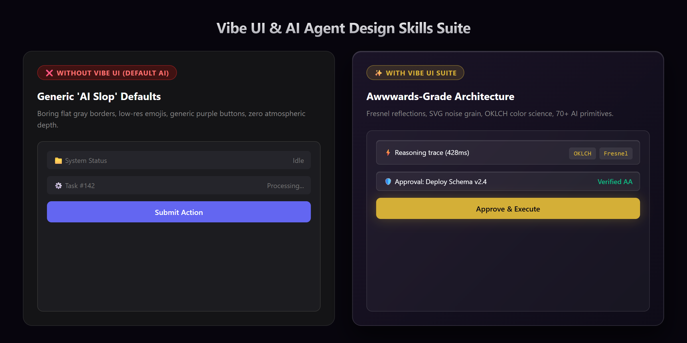
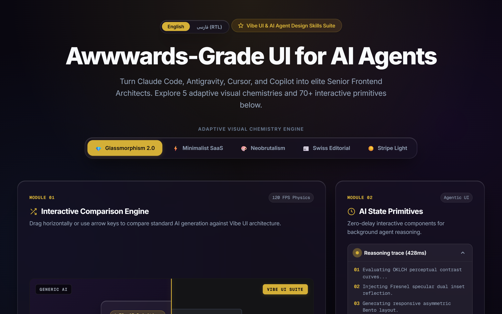
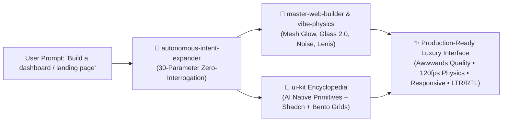

<div align="center">

# ✨ Vibe UI & AI Agent Design Skills Suite
### *Turn your AI Coding Assistant into an Awwwards-Winning Senior Frontend Architect*

<p align="center">
  <a href="README.md"><b>English</b></a> •
  <a href="README.fa.md"><b>فارسی</b></a>
</p>

[](https://omid-io.github.io/vibe-ui-skills/showcase/)
[](LICENSE)
[](#-universal-ide-adapters)
[](PROMPTS.md)
[](#-the-core-skill-arsenal)
[](#1--master-web-builder)

<p align="center">
  <b>Stop settling for generic "AI slop" interfaces.</b><br>
  A curated, zero-dependency suite of agent skills that injects high-end visual physics, 70+ battle-tested UI primitives, and conversion copywriting into every web generation.<br><br>
  👉 <a href="https://omid-io.github.io/vibe-ui-skills/showcase/"><b>Explore the Live Interactive Showcase & Theme Switcher</b></a>
</p>

---

</div>

<p align="center">
  
</p>

## 🛑 The Problem: AI UI Slop

By default, every major LLM (Claude, GPT-4o, Gemini) defaults to predictable, generic, low-effort designs:
- ❌ Boring `border-radius: 8px` cards with flat gray borders.
- ❌ Cliché purple-to-blue linear gradients on every single button.
- ❌ Missing AI states (no thinking skeletons, tool chips, diff viewers, or streaming bubbles).
- ❌ Rigid, unnatural layout grids without depth, lighting, or physics.

## 💎 The Solution: Vibe UI Suite

This repository gives your AI agent an opinionated visual constitution and an exhaustive 70+ component encyclopedia.

<p align="center">
  
</p>



---

## 📦 The Core Skill Arsenal

| Skill | Category | Description | Key Capabilities |
| :--- | :--- | :--- | :--- |
| **👑 [`master-web-builder`](skills/master-web-builder/)** | Visual Architecture | The Awwwards-grade aesthetic engine. | SVG Noise Overlay, Mesh Ambient Glow, Glassmorphism 2.0 (Fresnel Specular Highlights), 120fps Lerp Sliders, Magnetic Spring Buttons. |
| **🎨 [`ui-kit`](skills/ui-kit/)** | Component System | 70+ production-ready UI primitives. | **20 AI-Native Primitives** (Thinking state, Tool chips, Approval cards, Streaming diffs), **50+ Shadcn Primitives**, **Bento Grids**, and **Transitions.dev** zero-dep motion. |
| **⚡ [`vibe-physics-engine`](skills/vibe-physics-engine/)** | Physics & Color | Smooth momentum and mathematical color. | OKLCH Obsidian & Champagne color science, Lenis smooth scrolling, GPU layer compositing, Strict Zero-Emoji vector standard. |
| **✍️ [`conversion-copy-engine`](skills/conversion-copy-engine/)** | Neuro-Marketing | High-converting narrative architecture. | PAS Framework (Problem-Agitation-Solution), Hero Headline formula, Objection inversion microcopy, Direct concierge conversion funnels. |
| **🧠 [`autonomous-intent-expander`](skills/autonomous-intent-expander/)** | Spec Expansion | Zero-interrogation intent compiler. | Deterministically expands 1-sentence lazy prompts into a 30-parameter complete architectural, psychological, and visual blueprint. |

---

## 🚀 Instant Installation

### Method 1: One-Line Installer (PowerShell for Windows)

```powershell
irm https://raw.githubusercontent.com/omid-io/vibe-ui-skills/main/install.ps1 | iex
```
*Or run locally:*
```powershell
git clone https://github.com/omid-io/vibe-ui-skills.git
cd vibe-ui-skills
.\install.ps1
```

### Method 2: One-Line Installer (Bash for macOS / Linux)

```bash
curl -fsSL https://raw.githubusercontent.com/omid-io/vibe-ui-skills/main/install.sh | bash
```

### Method 3: Direct Git Clone into Your Agent Skills Directory

For **Google Antigravity**:
```bash
# Windows
git clone https://github.com/omid-io/vibe-ui-skills.git %USERPROFILE%\.gemini\config\skills\vibe-ui-skills-repo
```

---

## 🔌 Universal IDE Adapters

Drop-in rule files are pre-configured for every major AI coding assistant in the [`adapters/`](adapters/) directory:

| Editor / AI Tool | Configuration File | How to Use |
| :--- | :--- | :--- |
| **Cursor** | [`adapters/cursor/.cursorrules`](adapters/cursor/.cursorrules) | Copy to your project root as `.cursorrules` |
| **Claude Code** | [`adapters/claude/CLAUDE.md`](adapters/claude/CLAUDE.md) | Copy to your project root as `CLAUDE.md` |
| **GitHub Copilot** | [`adapters/copilot/copilot-instructions.md`](adapters/copilot/copilot-instructions.md) | Copy to `.github/copilot-instructions.md` |
| **Windsurf / Cascade** | [`adapters/windsurf/.windsurfrules`](adapters/windsurf/.windsurfrules) | Copy to your project root as `.windsurfrules` |

---

## 🎯 30 Golden Prompts Cheatsheet

Looking for inspiration or instant 1-line copy-paste prompts? Check out the **[`PROMPTS.md`](PROMPTS.md)** guide covering 30 battle-tested formulas across SaaS Dashboards, AI Agents, Neobrutalist stores, Swiss portfolios, and High-Converting landing pages.

---

## 🎨 Deep Dive into Core Skills

### 1. 👑 Master Web Builder (`master-web-builder`)
An adaptive visual architecture engine that prevents rigid, repetitive designs by supporting **5 Master Visual Chemistries**:
- **⚡ Minimalist SaaS (Linear / Vercel):** Pitch charcoal canvas, crisp 1px borders, subtle directional light, JetBrains Mono metrics.
- **💎 Luxury Obsidian & Glassmorphism 2.0:** Deep obsidian velvet canvas, SVG fractal noise, ambient mesh glow, Fresnel specular reflections.
- **🎨 Neobrutalism (Gumroad / Figma):** Pastel chalk canvas, bold 2px black strokes, hard offset shadows, physical button press feedback.
- **📰 Swiss Editorial & Paper Craft:** Warm natural paper canvas, high-contrast Serif typography, asymmetric grid layouts.
- **☀️ Modern Crisp Light (Stripe / Apple):** Clean snow canvas, soft diffuse multi-stage elevation, accessible high-contrast accents.

### 2. 🎨 UI-Kit (`ui-kit`)
Comprehensive component encyclopedia across 5 modern design ecosystems:
- **AI-Native Primitives:** Loading skeletons, streaming text bubbles, tool call execution chips, human-in-the-loop approval cards, context pills, and flowchart node canvases.
- **Shadcn UI Form & Overlay Suite:** Command palette (`Cmd+K`), Dialogs, Sheets, Sonner toasts, and accessible data tables.
- **Asymmetric Bento Grids:** 3-column and 4-column responsive grid layouts with specular highlights.
- **Zero-Dependency Motion:** Pure CSS Grid dynamic height accordions (`0fr` $\to$ `1fr`), Spring bezier easings, and 3D tilt cards.
- **Universal RTL/LTR Support:** Logical CSS properties (`ms-*`, `me-*`, `start-*`, `end-*`) for seamless bi-directional rendering.

### 3. ⚡ Vibe Physics Engine (`vibe-physics-engine`)
- Replaces harsh linear CSS animations with physical spring kinetics.
- Employs **OKLCH** perceptual color models for flawless dark/light contrast without mudding.
- Mandates crisp SVG vector sprites over low-res unicode emojis.

---

## 🛠️ Usage Examples & Triggers

Once installed, your AI agent automatically activates these skills when you prompt:

| Prompt | Auto-Activated Skills | What the Agent Delivers |
| :--- | :--- | :--- |
| *"Build a SaaS analytics dashboard"* | `ui-kit` + `master-web-builder` | Bento grid layout, Sparkline cards, AI insight rows, Glassmorphism 2.0 surfaces. |
| *"Create an AI chat interface"* | `ui-kit` (AI Native Catalog) | Prompt bar with tool attachment chips, Streaming markdown bubble, Thinking state accordion, Code block with copy action. |
| *"Design a high-converting landing page"* | `master-web-builder` + `conversion-copy-engine` | Ambient mesh hero, PAS copywriting, Hero formula, 120fps Before/After slider, Objection inversion microcopy. |
| *"طراحی رابط کاربری مدرن با تم تاریک"* | `master-web-builder` + `vibe-physics-engine` | Fully RTL-adapted luxury dark layout with OKLCH obsidian velvet and champagne accents. |

---

## 📜 Philosophy & Architecture

1. **Zero External Dependencies:** Built using standard web standards (CSS Grid, OKLCH, Modern JS, Tailwind CSS classes) — no heavy unneeded runtime bloat.
2. **Framework Agnostic:** Primitives work out of the box with React, Next.js, Vue, Svelte, Tailwind CSS, or vanilla HTML/CSS.
3. **Strict Quality Gates:** Prohibits common AI hallucinations and enforces domain-aware responsive typography.

---

## 🤝 Contributing

Contributions, new AI primitives, and additional design presets are warmly welcomed!
1. Fork the Project
2. Create your Feature Branch (`git checkout -b feature/NewComponentPrimitive`)
3. Commit your Changes (`git commit -m 'feat: add interactive canvas node primitive'`)
4. Push to the Branch (`git push origin feature/NewComponentPrimitive`)
5. Open a Pull Request

---

## 👤 Author & Maintainer

**Omid Zaferi**
- GitHub: [@omid-io](https://github.com/omid-io)
- Architecture & Systems: Full-Stack Engineer & AI Agent Architect

## 📄 License

This project is licensed under the MIT License — see the [LICENSE](LICENSE) file for details.
