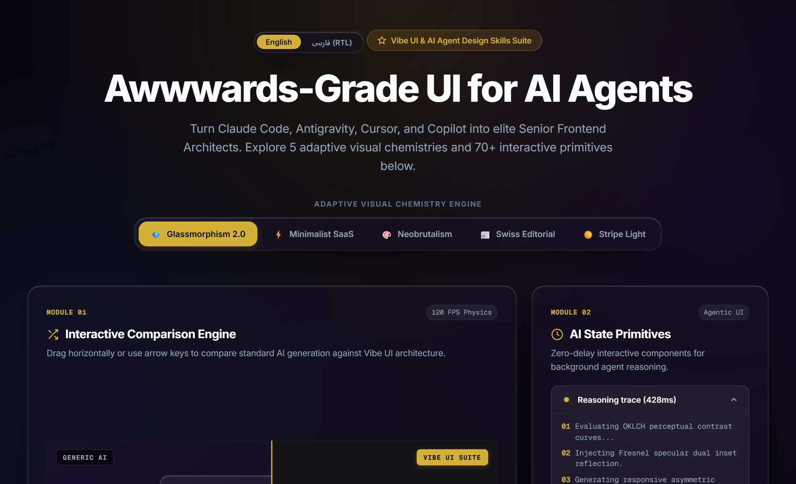

<div align="center">

# 👑 mr-ui-designer & Vibe UI Suite
### *Production-Grade UI Architecture, Component Recipes & Design Intelligence for AI Agents*

<p align="center">
  <a href="README.md"><b>English</b></a> •
  <a href="README.fa.md"><b>فارسی</b></a>
</p>

[](mr-ui-designer/AGENT.md)
[](https://omid-io.github.io/vibe-ui-skills/showcase/)
[](LICENSE)
[](#-universal-ide-adapters)
[](PROMPTS.md)
[](#-the-sub-skills-arsenal)

<p align="center">
  <b>Eliminate generic, low-effort AI interface outputs.</b><br>
  <b><code>mr-ui-designer</code></b> is an autonomous frontend architect agent that commands a modular arsenal of 6 specialized design, physics, and verification skills—injecting deliberate visual chemistries, 70+ battle-tested UI primitives, WCAG AA accessibility, and conversion copy into AI coding workflows.<br><br>
  👉 <a href="https://omid-io.github.io/vibe-ui-skills/showcase/"><b>Explore the Live Interactive Showcase & Theme Switcher</b></a>
</p>

---

</div>

<p align="center">
  
</p>

## 🛑 The Problem: AI UI Slop

By default, every major LLM (Claude, GPT-4o, Gemini) defaults to predictable, generic, low-effort designs:
- ❌ Boring `border-radius: 8px` cards with flat gray borders.
- ❌ Cliché purple-to-blue linear gradients on every single button.
- ❌ Missing AI states (no thinking skeletons, tool chips, diff viewers, or streaming bubbles).
- ❌ Rigid, unnatural layout grids without depth, lighting, or physics.

## 👑 The Solution: mr-ui-designer (Master Orchestrator Agent)

Instead of relying on disconnected prompts, **`mr-ui-designer`** operates as a specialized **Lead Frontend Architect**. When you ask it to design or build an interface, it autonomously orchestrates an arsenal of **6 specialized sub-skills**:

<p align="center">
  
</p>


---

## 📦 The 6 Sub-Skills Arsenal (Commanded by mr-ui-designer)

| Skill | Category | Description | Key Capabilities |
| :--- | :--- | :--- | :--- |
| **🎨 [`visual-chemistry-engine`](skills/visual-chemistry-engine/)** | Visual Architecture | Adaptive visual design engine across 5 distinct chemistries. | SVG Noise Overlay, Mesh Ambient Glow, Glassmorphism 2.0 (Fresnel Specular Highlights), Anti-Repetition Protocol, Frame-rate-independent Lerp Sliders, Magnetic Spring Buttons. |
| **🧩 [`ui-kit`](skills/ui-kit/)** | Component System | 70+ AI-ready UI component recipes. | **20 AI-Native Primitives** (Thinking state, Tool chips, Approval cards, Streaming diffs), **50+ Shadcn Primitives**, **Bento Grids**, and **Transitions.dev** zero-dep motion. |
| **⚡ [`vibe-physics-engine`](skills/vibe-physics-engine/)** | Physics & Motion | Smooth momentum and mathematical color. | OKLCH Multi-Chemistry color tokens, Zero-dep native smooth scroll + progressive modern Lenis, GPU layer compositing, Strict Zero-Emoji vector standard. |
| **✍️ [`conversion-copy-engine`](skills/conversion-copy-engine/)** | Value Copywriting | Domain-calibrated value propositions. | Multi-domain frameworks (B2B JTBD/ROI, Luxury Status, Healthcare Trust), Hero Headline formula, Objection inversion microcopy, Anti-Dark-Pattern policy. |
| **🧠 [`autonomous-intent-expander`](skills/autonomous-intent-expander/)** | Spec Expansion | Opinionated specification synthesizer. | Converts 1-sentence lazy prompts into a 30-parameter complete architectural, psychological, and visual specification with calibrated Ambiguity Budget. |
| **🔍 [`ui-verifier`](skills/ui-verifier/)** | Quality & Audit | 5-Pillar automated frontend auditor. | Full inspection of WCAG 2.2 AA Accessibility, Responsive Breakpoints (375/768/1440), Anti-Slop Visual Quality, Compositing Performance, and Semantic RTL/BiDi. |

---

## 📐 Semantic & Fixed-Structure RTL Architecture

Vibe UI solves the notorious layout shift problem present in generic AI web generators:
- ❌ **Standard AI Failure:** Inverting the entire layout grid, swapping column positions, reversing navbar menus, and shifting interactive buttons horizontally when switching to RTL / Persian.
- ✅ **The Vibe UI Standard:** Global grid columns, module cards, slider tracks, and navigation bars remain **physically stable in place**. RTL direction is applied to textual content, mixed English brand names never scramble punctuation, directional affordances mirror semantically, and all code/metric blocks remain pure LTR monospace.

---

## 🚀 Instant Installation

### 🤖 Method 0: 1-Prompt Agent Auto-Install (Zero CLI / Just Tell Your AI)

The easiest way to install! Simply copy and paste this single prompt directly into your AI coding assistant (**Antigravity, Cursor Composer, Claude Code, Copilot, or Windsurf**):

> **Copy & paste this prompt into your AI assistant:**
> ```text
> Please install the Vibe UI Skills Suite from https://github.com/omid-io/vibe-ui-skills into my active AI agent environment (or skills directory). Clone/download the skills from the repository, place them in the appropriate agent skills path, and verify that visual-chemistry-engine, ui-kit, and ui-verifier are ready to use.
> ```

---

### Method 1: One-Line Terminal Installer (PowerShell for Windows)

```powershell
irm https://raw.githubusercontent.com/omid-io/vibe-ui-skills/main/install.ps1 | iex
```
*Or run locally:*
```powershell
git clone https://github.com/omid-io/vibe-ui-skills.git
cd vibe-ui-skills
.\install.ps1
```

### Method 2: One-Line Terminal Installer (Bash for macOS / Linux)

```bash
curl -fsSL https://raw.githubusercontent.com/omid-io/vibe-ui-skills/main/install.sh | bash
```

### Method 3: Local Clone & Setup

```bash
git clone https://github.com/omid-io/vibe-ui-skills.git
cd vibe-ui-skills
# On Windows PowerShell:
.\install.ps1
# On macOS / Linux:
./install.sh
```

---

## 🔌 Universal IDE Adapters

Drop-in rule files are pre-configured for every major AI coding assistant in the [`adapters/`](adapters/) directory:

| Editor / AI Tool | Configuration File | How to Use |
| :--- | :--- | :--- |
| **Cursor** | [`adapters/cursor/.cursorrules`](adapters/cursor/.cursorrules) | Copy to your project root as `.cursorrules` |
| **Claude Code** | [`adapters/claude/CLAUDE.md`](adapters/claude/CLAUDE.md) | Copy to your project root as `CLAUDE.md` |
| **GitHub Copilot** | [`adapters/copilot/copilot-instructions.md`](adapters/copilot/copilot-instructions.md) | Copy to `.github/copilot-instructions.md` |
| **Windsurf / Cascade** | [`adapters/windsurf/.windsurfrules`](adapters/windsurf/.windsurfrules) | Copy to your project root as `.windsurfrules` |

---

## 🎯 30 Golden Prompts Cheatsheet

Looking for inspiration or instant 1-line copy-paste prompts? Check out the **[`PROMPTS.md`](PROMPTS.md)** guide covering 30 battle-tested formulas across SaaS Dashboards, AI Agents, Neobrutalist stores, Swiss portfolios, and High-Converting landing pages.

---

## 🎨 Deep Dive into the 6 Sub-Skills

### 1. 🧠 Intent Expansion (`autonomous-intent-expander`)
- Transforms sparse 1-sentence prompts into a comprehensive 30-parameter technical, visual, and UX specification.
- Enforces an **Ambiguity Budget**: automatically assumes standard UI layout decisions while surfacing explicit assumptions for high-risk business, security, or compliance constraints.

### 2. 🎨 Visual Chemistry Engine (`visual-chemistry-engine`)
An adaptive visual architecture engine that prevents rigid, repetitive designs by supporting **5 Master Visual Chemistries**:
- **⚡ Minimalist SaaS (Linear / Vercel):** Pitch charcoal canvas, crisp 1px borders, subtle directional light, JetBrains Mono metrics.
- **💎 Luxury Obsidian & Glassmorphism 2.0:** Deep obsidian velvet canvas, SVG fractal noise, ambient mesh glow, Fresnel specular reflections.
- **🎨 Neobrutalism (Gumroad / Figma):** Pastel chalk canvas, bold 2px black strokes, hard offset shadows, physical button press feedback.
- **📰 Swiss Editorial & Paper Craft:** Warm natural paper canvas, high-contrast Serif typography, asymmetric grid layouts.
- **☀️ Modern Crisp Light (Stripe / Apple):** Clean snow canvas, soft diffuse multi-stage elevation, accessible high-contrast accents.
- **🛡️ Anti-Repetition Protocol:** Guarantees novelty across projects by altering at least 3 structural dimensions.

### 3. 🧩 Component Recipes (`ui-kit`)
Comprehensive component encyclopedia across 6 modern design ecosystems:
- **AI-Native Primitives:** Loading skeletons, streaming text bubbles, tool call execution chips, human-in-the-loop approval cards, context pills, and flowchart node canvases.
- **Shadcn UI Form & Overlay Suite:** Command palette (`Cmd+K`), Dialogs, Sheets, Sonner toasts, and accessible data tables.
- **Asymmetric Bento Grids:** 3-column and 4-column responsive grid layouts with specular highlights.
- **Zero-Dependency Motion:** Pure CSS Grid dynamic height accordions (`0fr` $\to$ `1fr`), Spring bezier easings, and 3D tilt cards.
- **Universal RTL/LTR Support:** Logical CSS properties (`ms-*`, `me-*`, `start-*`, `end-*`) for seamless bi-directional rendering.

### 4. ⚡ Motion & Physics (`vibe-physics-engine`)
- Replaces harsh linear CSS animations with physical spring kinetics.
- Employs **OKLCH** perceptual color models for flawless dark/light contrast without mudding.
- Zero-dep native smooth scroll fallback + progressive modern Lenis momentum.
- Mandates crisp SVG vector sprites over low-res unicode emojis.

### 5. ✍️ Strategic Value Copy (`conversion-copy-engine`)
- Domain-calibrated narrative frameworks (B2B SaaS JTBD/ROI, Luxury status, Healthcare trust).
- PAS (Problem-Agitation-Solution) narrative sequencing and Hero Headline formulas.
- **Anti-Dark-Pattern Policy:** Prohibits fabricating fake user testimonials, synthetic reviews, or false urgency timers.

### 6. 🔍 Quality Gate & Audit (`ui-verifier`)
- 5-pillar inspection pipeline validating Accessibility (WCAG 2.2 AA), Responsive breakpoints (375px/768px/1440px), Anti-Slop aesthetics, Performance, and Semantic RTL.

---

## 🧪 Evaluation Benchmarks & Concrete Examples

Unlike prompt libraries that only offer unverified claims, this repository includes an empirical **Evaluation Suite ([`evals/`](evals/))** and **Production Examples ([`examples/`](examples/))**:

- **[`evals/`](evals/)**: Formal benchmark test cases ([`saas_dashboard_eval.md`](evals/saas_dashboard_eval.md), [`persian_rtl_landing_eval.md`](evals/persian_rtl_landing_eval.md), [`ai_chat_interface_eval.md`](evals/ai_chat_interface_eval.md)) specifying pass criteria, expected properties, and forbidden anti-patterns.
- **[`examples/`](examples/)**: Standalone, clean HTML/CSS output files:
  - [`examples/saas_ai_hero.html`](examples/saas_ai_hero.html): Minimalist SaaS hero with an accessible AI Thinking State and tool execution chip.
  - [`examples/persian_rtl_bento.html`](examples/persian_rtl_bento.html): Persian Bento Grid demonstrating semantic RTL, Vazirmatn font, and BiDi punctuation isolation.

---

## 🛠️ Usage Examples & Triggers

Once installed, your AI agent automatically activates these skills when you prompt:

| Prompt | Auto-Activated Skills | What the Agent Delivers |
| :--- | :--- | :--- |
| *"Build a SaaS analytics dashboard"* | `ui-kit` + `visual-chemistry-engine` | Bento grid layout, Sparkline cards, AI insight rows, Glassmorphism 2.0 surfaces. |
| *"Create an AI chat interface"* | `ui-kit` (AI Native Catalog) | Prompt bar with tool attachment chips, Streaming markdown bubble, Thinking state accordion, Code block with copy action. |
| *"Design a high-converting landing page"* | `visual-chemistry-engine` + `conversion-copy-engine` | Ambient mesh hero, PAS / JTBD copywriting, Hero formula, Sub-pixel Before/After slider, Objection inversion microcopy. |
| *"بررسی ظاهر و استانداردهای طراحی"* | `ui-verifier` | Comprehensive 5-pillar scorecard evaluating accessibility, responsiveness, and visual quality. |
| *"طراحی رابط کاربری مدرن با تم تاریک"* | `visual-chemistry-engine` + `vibe-physics-engine` | Fully RTL-adapted luxury dark layout with OKLCH obsidian velvet and champagne accents. |

---

## 📜 Philosophy & Architecture

1. **Zero Runtime Dependencies in Core:** Built using standard web standards (CSS Grid, OKLCH, Modern JS, Tailwind CSS classes) — no heavy unneeded runtime bloat.
2. **Framework Agnostic:** Primitives work out of the box with React, Next.js, Vue, Svelte, Tailwind CSS, or vanilla HTML/CSS.
3. **Strict Quality & Accessibility Gates:** Prohibits common AI hallucinations, enforces WCAG AA accessibility, and supports `@media (prefers-reduced-motion: reduce)`.

---

## 🤝 Contributing

Contributions, new AI primitives, and additional design presets are warmly welcomed!
1. Fork the Project
2. Create your Feature Branch (`git checkout -b feature/NewComponentPrimitive`)
3. Commit your Changes (`git commit -m 'feat: add interactive canvas node primitive'`)
4. Push to the Branch (`git push origin feature/NewComponentPrimitive`)
5. Open a Pull Request

---

## 👤 Author & Maintainer

**Omid Zaferi**
- GitHub: [@omid-io](https://github.com/omid-io)
- Architecture & Systems: Full-Stack Engineer & AI Agent Architect

## 📄 License

This project is licensed under the MIT License — see the [LICENSE](LICENSE) file for details.
