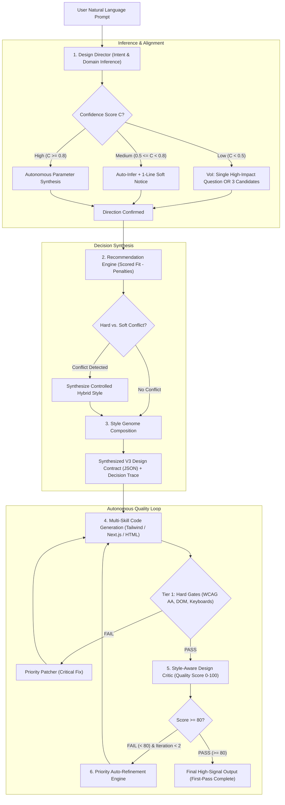

# 🧠 Vibe UI v3.0 Master Architecture & Engineering Specification
## From "Static Style Catalog" to "Autonomous Design Decision Engine & Director"

---

## 📑 فهرست مطالب (Table of Contents)
1. [خلاصه مدیریتی (Executive Summary)](#-خلاصه-مدیریتی-executive-summary)
2. [دیاگرام معماری کلان (System Architecture DAG)](#-دیاگرام-معماری-کلان-system-architecture-dag)
3. [زیرسیستم‌های هسته V3 (The Core Subsystems)](#-زیرسیستمهای-هسته-v3-the-core-subsystems)
4. [موتور تصمیم‌گیری، نمره‌دهی و حل تعارض (Decision Engine & Conflict Resolution)](#-موتور-تصمیمگیری-نمرەدهی-و-حل-تعارض-decision-engine--conflict-resolution)
5. [گیت‌های پذیرش دولایه و شاخص‌های زحمت کاربر (Two-Tier Gates & User-Effort KPIs)](#-گیتهای-پذیرش-دولایه-و-شاخصهای-زحمت-کاربر-two-tier-gates--user-effort-kpis)
6. [حل قطعی ۷ مجهول کلیدی معماری (Exhaustive Resolution of All 7 Unknowns)](#-حل-قطعی-۷-مجهول-کلیدی-معماری-exhaustive-resolution-of-all-7-unknowns)
7. [نقشه راه اجرایی ۱۲ مرحله‌ای (12-Phase Execution Pipeline)](#-نقشه-راه-اجرایی-۱۲-مرحلهای-12-phase-execution-pipeline)

---

## 🏛️ خلاصه مدیریتی (Executive Summary)
نسخه فعلی پروژه (`v2.4.2`) زیرساخت مهندسی مکانیکی، ریاضی کنتراست رنگ (WCAG AA)، آزمون‌های مرورگر Playwright، پکیج‌های رجیستری و سیستم ضدگلوله راست‌چین سمنتیک (Semantic RTL) را با موفقیت اثبات کرده است. 

اما بزرگ‌ترین خلأ پروژه این بود که به عنوان یک **«مجموعه ابزار با ۵ پوسته ثابت»** رفتار می‌کرد و فاقد **«موتور تصمیم‌گیری، استنتاج و خودانتقادی طراحی»** بود. در نتیجه، کاربر مجبور می‌شد مفاهیم تخصصی دیزاین را بداند و برای رسیدن به یک نتیجه جذاب، بارها و بارها پرامپت اصلاحی بدهد.

این سند، **معماری جامع نسل سوم (V3: Design Intelligence)** را به صورت یکپارچه و ۱۰۰٪ بدون مجهول پایه‌ریزی می‌کند:
1. **کاربر عادی** فقط یک پرامپت ساده از نیاز کسب‌وکارش می‌دهد (`یک سایت برای کلینیک پوست و زیبایی`).
2. سیستم خودش دامین، مخاطب، میزان اعتماد، انرژی بصری و اولویت‌ها را با **مدل آستانه اطمینان (Confidence Model)** استنتاج می‌کند.
3. در صورت ابهام، سیستم **فقط ۱ سوال باارزش (VoI)** یا **۳ مسیر کاندید با لحن ملموس** ارائه می‌دهد، نه ۱۵ سوال پیچیده فنی.
4. سبک‌ها از ۵ تم هاردکد شده به **«ژنوم طراحی (Design Genome)»** ارتقا می‌یابند ($\text{Style} \times \text{Mood} \times \text{Density} \times \text{Mode}$).
5. قبل از تحویل به کاربر، سیستم خودش در نقش **منتقد طراحی (Design Critic)** ظاهر شده و با **چرخه اصلاح خودکار اولویت‌بندی شده (حداکثر ۲ دور)** ایرادات را رفع می‌کند.
6. هدف نهایی: **کیفیت در اولین شات (First-Pass Quality > 70%) و رساندن دفعات ویرایش دستی طراح به زیر ۱.۵ بار.**

---

## 🏛️ دیاگرام معماری کلان (System Architecture DAG)



---

## 🧩 زیرسیستم‌های هسته V3 (The Core Subsystems)

### ۱. `design-director` (مغز استراتژیک و استنتاج دامین)
از پرامپت خام کاربر، ابعاد کسب‌وکاری زیر استخراج می‌شود بدون اینکه کاربر واژگان فنی بداند:

```json
{
  "product_domain": "luxury_clinical_dermatology",
  "primary_audience": "high_net_worth_individuals",
  "trust_requirement": "very_high",
  "visual_energy": "calm_restrained",
  "density_profile": "airy_breathing",
  "platform_priority": "mobile_first",
  "value_hook": "clinical_accreditation_and_subtle_elegance"
}
```

#### قانون ارزش اطلاعات (Value of Information - VoI):
اگر سطح ابهام بالا بود:
* **ممنوعیت مطلق:** پرسیدن سوالات فنی گیج‌کننده (مثل کنتراست یا سیستم گرید).
* **ارائه ۳ مسیر ملموس:**
  * **مسیر الف (پیشنهادی):** باوقار و اصیل (Editorial Premium)
  * **مسیر ب:** مدرن و صمیمی (Soft Humanist)
  * **مسیر ج:** سازمانی و تمیز (Corporate Clean)

---

### ۲. `recommendation-engine` و اولویت‌های دامین (Design Priors)
هر صنعتی اولویت‌های ذاتی خودش را دارد:

| حوزه (Domain) | اولویت اصلی (Design Prior) | سبک‌های همگن | سبک‌های ممنوعه / پرریسک |
| :--- | :--- | :--- | :--- |
| **Fintech & Banking** | $\text{Trust} > \text{Novelty}$ | Swiss Editorial, Data-Dense, Clean Stripe | Neobrutalism, Cyberpunk Neon |
| **Healthcare & Clinics** | $\text{Clarity} + \text{Serenity} > \text{Decoration}$ | Soft Humanist, Quiet Luxury | Glitch Art, Harsh Shadows, Acid |
| **Trading & DevOps** | $\text{Density} + \text{Efficiency} > \text{Marketing}$ | Data-Dense Terminal, Monospace HUD | Fluffy Cards, Heavy Blur, Parallax |
| **Creative & Fashion** | $\text{Brand Distinction} > \text{Standard Grid}$ | Neo-Brutalism, Experimental Editorial | Generic Bootstrap/Tailwind Cards |
| **E-Commerce & Trades** | $\text{Conversion} > \text{Experimentation}$ | Crisp Minimal, Clear Pricing Cards | Complex Abstract 3D Meshes |

---

### ۳. `design-genome` (ژنوم جامع ۱۴ بعدی طراحی)
برای جلوگیری از محبوس شدن تصمیمات در پرامپت‌های پراکنده، ژنوم طراحی کل ابعاد یک رابط کاربری را در یک ماتریس ۱۴ بعدی استاندارد مدل‌سازی می‌کند:

$$\text{Interface Genome} = \mathbf{Domain} \times \mathbf{Audience} \times \mathbf{Brand} \times \mathbf{Mode} \times \mathbf{Style} \times \mathbf{Mood} \times \mathbf{Density} \times \dots$$

1. **حوزه و صنعت (Domain):** ۲۴ صنعت طبقه‌بندی شده (فین‌تک، پزشکی، تریدینگ، املاک و ...).
2. **پرسونای مخاطب (Audience):** سن، دانش فنی، سطح درآمد و زمینه کاربرد.
3. **شخصیت برند (Brand Personality):** باوقار، مدرن، پرانرژی، نوستالژیک یا صمیمی.
4. **حالت محصول (Product Mode):** Persuade (تبدیل), Operate (ابزار/ادمین), Read (مستندات), Experience (روایت‌گری).
5. **سبک پایه (Base Style):** ۱۲ سبک لنگری استاندارد (`minimal_swiss`, `clean_stripe`, `linear_dark`, `quiet_luxury`, `data_dense_terminal`, `neobrutalism`, `soft_humanist`, `organic_nordic`, `bauhaus_geometric`, `modern_glass_2`, `retro_futurism`, `editorial_magazine`).
6. **لحن و حس (Mood):** Calm, Serious, Energetic, Playful, Technical.
7. **تراکم چیدمان (Density):** Airy (باز), Balanced (متعادل), Dense (فشرده).
8. **سیستم تایپوگرافی (Typography System):** جفت‌های سریف، سنز و مونو به همراه معادل وب فارسی (وزیرمتن، دانا، یکان‌بخ).
9. **معماری رنگ (Color Architecture):** پالت OKLCH شامل Canvas، Surface، Accent، Border و Text با کنتراست تضمینی.
10. **هندسه و انحنا (Geometry & Radius):** Sharp (0-2px), Standard (4-8px), Soft (12-16px), Pill (9999px).
11. **عمق و سایه (Depth & Elevation):** Flat, Micro-shadow, Diffused, Specular Glass 2.0, Hard Drop (نئوبروتال).
12. **فیزیک انیمیشن (Motion Curves):** ثابت زمانی $\lambda=14$، منحنی‌های فنری و کنترل `prefers-reduced-motion`.
13. **بافت و متریال (Texture & Material):** پس‌زمینه سالید، گرین مات، شیشه نیمه‌شفاف کالیبره، نور لبه‌ای.
14. **رفتار حالات کامپوننت (State Completeness):** قرارداد رفتاری در حالات Default, Hover, Focus, Skeleton Loading, Empty, Error Retry.

---

## 🧮 موتور تصمیم‌گیری، نمره‌دهی و حل تعارض (Decision Engine & Conflict Resolution)

### ۱. مدل آستانه اطمینان عددی (Confidence Thresholds)
سیستم ضریب اطمینان میانگین ($\bar{C} \in [0.0, 1.0]$) را محاسبه می‌کند:
* **$\bar{C} \ge 0.80$ (اطمینان بالا):** استنتاج ۱۰۰٪ خودکار بدون مزاحمت برای کاربر.
* **$0.50 \le \bar{C} < 0.80$ (اطمینان متوسط):** استنتاج با یک اعلام ۱-خطی و تایید نرم.
* **$\bar{C} < 0.50$ (ابهام بالا):** فعال‌سازی پروتکل VoI (ارائه ۳ کاندید ملموس).

### ۲. فرمول نمره‌دهی چندعاملی انتخاب سبک
$$\text{Score}(S) = \sum_{i} w_i \cdot \text{Fit}_i(S) - \sum_{j} \text{Penalty}_j(S)$$
ضرایب وزن‌دهی: دامین ($0.25$)، مخاطب ($0.20$)، مود محصول ($0.20$)، لحن ($0.15$)، پلتفرم ($0.10$) و هدروم دسترسی‌پذیری ($0.10$). در صورت تداخل سبک نامناسب با دامین پرریسک، جریمه ۴۰- نمره اعمال می‌شود.

### ۳. حل تعارض قیدهای سخت و ترجیحات نرم (Conflict Resolver)
اگر کاربر سبکی خواست که با دامین ناسازگار است (مثلاً بروتالیسم برای اپلیکیشن بانکی):
* سیستم درخواست را رد نمی‌کند، بلکه یک **هیبرید کنترل‌شده (Controlled Hybrid)** تولید می‌کند:
  `Controlled Swiss Brutalism` (بوردرهای تیره و شارپ، اما با حفظ کامل فونت‌های خوانای تریدینگ و حذف هرگونه نویز تزئینی).

### ۴. ردپای تصمیمات طراحی (`decision_trace`)
هر خروجی شامل گزارش متادیتای تصمیم است تا مشخص باشد چرا این سبک، پالت و فونت انتخاب شدند:
```json
{
  "decision_trace": {
    "recommended_style": "quiet_luxury",
    "composite_score": 92.4,
    "rationale": [
      "High-trust clinical domain requires calm, non-sterile prestige.",
      "High-contrast serif typography paired with warm stone tones."
    ]
  }
}
```

### ۵. دریافت رنگ برند موجود و الگوبرداری از مراجع
* **Brand Ingestion:** اگر کاربر رنگ سازمانی یا لوگو داد، رنگ‌ها قفل شده (`locked_brand_palette`) و کنتراست سطوح بر مبنای همان رنگ بازتنظیم می‌شود.
* **Reference Principles:** اگر کاربر گفت «شبیه Linear اما گرم‌تر»، اصول معماری Linear (بوردر مویی، دارک عمیق) استخراج شده و به سمت پالت گرم شیفت داده می‌شود.

---

## 📊 گیت‌های پذیرش دولایه و شاخص‌های زحمت کاربر (Two-Tier Gates & User-Effort KPIs)

پذیرش نهایی خروجی منوط به پاس شدن معادله زیر است:
$$\text{Final Acceptance} = \mathbf{HardGates} \land (\text{QualityScore} \ge 80)$$

### سطح ۱: گیت‌های سخت باینری (Tier 1: Hard Gates - Pass/Fail)
1. **WCAG 2.2 AA Contrast Gate:** کنتراست بدنه $\ge 4.5:1$ و تیترها $\ge 3.0:1$.
2. **Mobile Layout Integrity Gate:** صفر درصد اورفلو در عرض‌های ۳۲۰px و ۳۷۵px.
3. **Keyboard & Focus Ring Gate:** داشتن استایل واضح `:focus-visible`.
4. **Accessible Label Gate:** وجود `aria-label` یا عنوان غیرخالی روی کنترل‌ها.
5. **Reduced Motion Gate:** خاموش شدن انیمیشن‌های طولانی در `prefers-reduced-motion`.
6. **Zero Raw Emojis Gate:** صفر درصد ایموجی متنی؛ الزام استفاده از آیکون SVG.

### سطح ۲: کارت امتیازی چندبعدی منتقد طراحی (Tier 2: Critic Multi-Dimensional Scorecard - 0 to 100)
برخلاف مدل‌های ساده که یک نمره کلی و مبهم می‌دهند، منتقد طراحی ۹ بعد مستقل و قابل‌سنجش را ارزیابی می‌کند:

1. **سلسله‌مراتب اسکن دیداری (Visual Hierarchy - ۱۵ نمره):** وضوح خطوط دید (Z یا F)، هدایت نگاه و داشتن یک CTA غالب در اولین ۳ ثانیه.
2. **اصالت و مقابله با کلیشه (Distinctiveness / Anti-Slop - ۱۵ نمره):** کسر نمره برای استفاده از گرادیان بنفش کلیشه‌ای، کارت‌های کپی‌شده یکنواخت و تمپلیت‌های تکراری.
3. **تناسب با دامین و هدف (Domain & Intent Fit - ۱۵ نمره):** انطباق لحن بصری با صنعت (مثلاً حفظ پرستیژ در پزشکی یا تراکم در تریدینگ).
4. **کاربردپذیری و تاچ‌تارگت (Usability & Targets - ۱۰ نمره):** رعایت فاصله ۸px+ بین دکمه‌ها و حداقل ابعاد ۴۴px در موبایل.
5. **تایپوگرافی و تضاد مقیاس (Typography Hierarchy - ۱۰ نمره):** تمایز شارپ تیترها از متن بدنه و تناسب فونت انگلیسی و فارسی.
6. **پایداری موبایل و پاسخ‌گویی (Responsive Integrity - ۱۰ نمره):** ری‌فلو تمیز محتوا بدون اسکرول افقی در عرض‌های کوچک.
7. **کامل بودن حالات (State Completeness - ۱۰ نمره):** وجود اسکلتون لودینگ، استیت خالی و مدیریت خطا.
8. **انسجام با برند (Brand Coherence - ۱۰ نمره):** هماهنگی المان‌ها با پالت و هویت سازمانی کاربر.
9. **بار پردازشی و بودجه بلور (Performance Budget - ۵ نمره):** رعایت بودجه بلور شیشه‌ای ($\le 2$ لایه) و عدم افت فریم.

* **آستانه قبولی نهایی:** حداقل ۸۰ از ۱۰۰ (مشروط به پاس شدن ۱۰۰٪ گیت‌های سخت سطح ۱).

### صف اولویت‌بندی پچ‌های خوداصلاحی:
$$\text{Critical Blockers} \longrightarrow \text{High-Impact Visual} \longrightarrow \text{Usability / States} \longrightarrow \text{Aesthetic Polish}$$
حداکثر سقف تکرار حلقه خوداصلاحی: **۲ دور**.

### شاخص‌های کلیدی زحمت کاربر (User-Effort KPIs):
* **First-Pass Success Rate:** بیش از **۷۰٪** خروجی‌ها در شات اول بدون پرامپت اصلاحی پذیرفته شوند.
* **Average Correction Prompts:** میانگین دفعات نیاز به پرامپت اصلاحی به **زیر ۱.۵ بار** برسد.
* **Correction Token Volume:** حجم توکن‌های اصلاحی کاربر به **زیر ۱۵۰ توکن** برسد.
* **Time to Acceptable Result:** رسیدن به طراحی ایده‌آل در **کمتر از ۴۵ ثانیه**.

---

## 🔬 حل قطعی ۷ مجهول کلیدی معماری (Exhaustive Resolution of All 7 Unknowns)

1. **سازگاری با گذشته (Backward Compatibility):** ارتقای اسکیما کاملاً افزایشی (Additive) است؛ تمام فایل‌ها و آزمون‌های نسخه `v2.4.2` بدون تغییر با کد خروج ۰ پاس می‌شوند.
2. **پردازش زبان طبیعی و تطبیق دامین با مدل اطمینان (Bilingual NLP & No Silent Fallbacks):**
   * در `taxonomy.json` برای هر دامین ده‌ها تگ و مترادف دوزبانه تعریف شده و حروف نرمالایز می‌شوند.
   * **جلوگیری از خطای پنهان:** اگر ضریب اطمینان زیر ۰.۵۰ باشد، سیستم هرگز به صورت خاموش (Silently) به دامین دیگر تغییر جهت نمی‌دهد؛ بلکه با اعلام سطح اطمینان، پروتکل ۳ کاندیدا یا ۱ سوال باارزش (VoI) را فعال می‌کند. دامین عمومی صرفاً در صورتی استفاده می‌شود که کاربر صراحتاً بگوید: «تصمیم را به خودت می‌سپارم».
3. **لود پایدار فونت‌ها و جبران شیفت چیدمان (Font Metric Compensation & CLS Prevention):**
   * استفاده از فونت استاندارد **وزیرمتن (Vazirmatn)** از CDN جهانی Google Fonts.
   * برای جلوگیری از پرش و شیفت لایه‌بندی در قطع اینترنت یا تاخیر لود (FOIT/FOUT)، فونت‌های پشتیبان سیستمی با ویژگی‌های جبران متریک فونت (`font-display: swap`, `size-adjust`) تنظیم می‌شوند تا شاخص Cumulative Layout Shift همواره زیر ۰.۱ ($CLS < 0.1$) باقی بماند.
4. **منتقد طراحی سبک‌آگاه (Style-Aware Critic):** خط‌کش نقد برای هر سبک مجزاست؛ مثلاً سایه سخت مشکی در نئوبروتالیسم مجاز است، اما در سوئیسی خطا محسوب می‌شود.
5. **اشتراک داده بین پایتون، نود و اکستنشن (Single Source of Truth):** داده‌ها در قالب فایل‌های JSON استاندارد در پوشه `data/` ذخیره می‌شوند و مستقیماً توسط پایتون، تایپ‌اسکریپت، CLI و اکستنشن بدون تبدیل کدهای موازی خوانده می‌شوند.
6. **اصلاح خودکار اولویت‌بندی شده و مهار رگرسیون (Priority Refinement & Anti-Regression):**
   * سقف تکرار: حداکثر ۲ دور. هر پچ اصلاحی صرفاً روی بزرگ‌ترین نقص شناسایی‌شده (از صف اولویت: بحرانی ➔ ظاهر ➔ کاربردپذیری) متمرکز می‌شود.
   * **تست ضد رگرسیون:** بعد از اعمال هر پچ، تمام گیت‌های سخت (Hard Gates) مجدداً ارزیابی می‌شوند تا اطمینان حاصل شود اصلاح یک نقص ظاهری، منجر به افت کنتراست یا خرابی کیبورد نشده است.
7. **پرامپت کوتاه در برابر بلند (Assisted vs. Expert Mode):** کاربر عادی با پرامپت یک‌خطی ۳ مسیر ملموس دریافت می‌کند؛ کاربر حرفه‌ای با پرامپت تخصصی، تنظیمات خود را بدون مداخله دریافت می‌کند.

---

## 📅 نقشه راه اجرایی ۱۲ مرحله‌ای (12-Phase Execution Pipeline)

```
┌────────────────────────────────────────────────────────────────────────────────────────┐
│ گام ۱: ساخت هسته تصمیم‌گیری (Design Intelligence Core & search.py)                      │
├────────────────────────────────────────────────────────────────────────────────────────┤
│ گام ۲: پایگاه دانش داده‌های طراحی (Design Knowledge Base: data/ JSONs)                 │
├────────────────────────────────────────────────────────────────────────────────────────┤
│ گام ۳: استنتاج، مدل اطمینان و پروتکل VoI (Inference, Confidence & 3-Candidates)        │
├────────────────────────────────────────────────────────────────────────────────────────┤
│ گام ۴: موتور توصیه نمره‌محور و ردپای تصمیم (Recommendation Scoring & Decision Trace)   │
├────────────────────────────────────────────────────────────────────────────────────────┤
│ گام ۵: ژنوم سبک‌ها و حل تعارض قیدها (Design Genome & Conflict Resolver)                │
├────────────────────────────────────────────────────────────────────────────────────────┤
│ گام ۶: تولید کدهای واکنش‌گرا و دوزبانه (Responsive Bilingual Code Generation)          │
├────────────────────────────────────────────────────────────────────────────────────────┤
│ گام ۷: منتقد طراحی سبک‌آگاه (Style-Aware Design Critic Engine)                         │
├────────────────────────────────────────────────────────────────────────────────────────┤
│ گام ۸: حلقه اصلاح خودکار اولویت‌بندی شده (Priority-Based Auto-Refinement Loop)          │
├────────────────────────────────────────────────────────────────────────────────────────┤
│ گام ۹: پلتفرم ارزیابی فیزیکی ۲.۰ (Verification 2.0: WCAG AA, Playwright, Reduced-Motion)│
├────────────────────────────────────────────────────────────────────────────────────────┤
│ گام ۱۰: گسترش تدریجی کاتالوگ سبک‌ها به ۲۴ خانواده استاندارد                            │
├────────────────────────────────────────────────────────────────────────────────────────┤
│ گام ۱۱: آزمون بنچ‌مارک ۱۰۰ سناریو و مقایسه A/B با هوش مصنوعی خام (A/B Evaluation)      │
├────────────────────────────────────────────────────────────────────────────────────────┤
│ گام ۱۲: ارتقای اکستنشن VS Code، ابزار CLI (@omid-io/tokens) و پایداری پروداکشن          │
└────────────────────────────────────────────────────────────────────────────────────────┘
```
