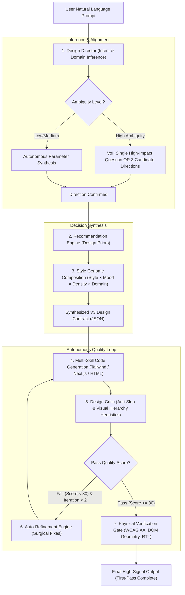

# 🧠 Vibe UI v3.0 Master Architecture & Engineering Specification
## From "Static Style Catalog" to "Autonomous Design Decision Engine & Director"

---

## Executive Summary (خلاصه مدیریتی)
نسخه فعلی پروژه (`v2.4.2`) زیرساخت مهندسی مکانیکی، ریاضی کنتراست رنگ (WCAG AA)، آزمون‌های مرورگر Playwright، پکیج‌های رجیستری و سیستم ضدگلوله راست‌چین سمنتیک (Semantic RTL) را با موفقیت اثبات کرده است. 

اما بزرگ‌ترین خلأ پروژه این بود که به عنوان یک **«مجموعه ابزار با ۵ پوسته ثابت»** رفتار می‌کرد و فاقد **«موتور تصمیم‌گیری، استنتاج و خودانتقادی طراحی»** بود. در نتیجه، کاربر مجبور می‌شد مفاهیم تخصصی دیزاین را بداند و برای رسیدن به یک نتیجه جذاب، بارها و بارها پرامپت اصلاحی بدهد.

این سند، معماری **نسل سوم (V3: Design Intelligence)** را پایه‌ریزی می‌کند. در این معماری:
1. **کاربر عادی** فقط یک پرامپت ساده از نیاز کسب‌وکارش می‌دهد (`یک سایت برای کلینیک پوست و زیبایی`).
2. سیستم خودش دامین، مخاطب، میزان اعتماد، انرژی بصری و اولویت‌ها را **استنتاج (Inference)** می‌کند.
3. در صورت ابهام، سیستم **فقط ۱ سوال باارزش** یا **۳ مسیر کاندید با لحن ملموس** ارائه می‌دهد، نه ۱۵ سوال پیچیده فنی.
4. سبک‌ها از ۵ تم هاردکد شده به **«ژنوم طراحی (Design Genome)»** ارتقا می‌یابند (ترکیب سبک، لحن، تراکم و دامین).
5. قبل از اینکه کد به کاربر نشان داده شود، سیستم خودش نقش **منتقد طراحی (Design Critic)** را بازی کرده و در یک چرخه بسته (حداکثر ۲ دور) ایرادات بصری و کلیشه‌های هوش مصنوعی (AI Slop) را اصلاح می‌کند.
6. هدف نهایی: **کیفیت در اولین شات (First-Pass Quality > 70%) و رساندن تعداد اصلاحات دستی کاربر به زیر ۲ بار.**

---

## 🏛️ System Architecture DAG (V3)



---

## 🧩 The 6 Core Subsystems of V3

### 1. `design-director` (The Strategic Brain)
به جای اینکه کاربر را با مشخصات فنی (مثل شعاع انحنا، فونت، درصد روشنایی) درگیر کنیم، `design-director` این ابعاد را از متن استخراج می‌کند:

```json
{
  "product_domain": "luxury_clinical_dermatology",
  "primary_audience": "high_net_worth_individuals",
  "trust_requirement": "very_high",
  "visual_energy": "calm_restrained",
  "density_profile": "airy_breathing",
  "platform_priority": "mobile_first",
  "value_hook": "clinical_accreditation_and_subtle_elegance"
}
```

#### قانون Value of Information (VoI):
اگر کاربر پرامپت مبهمی مثل «یک سایت برای شرکتم بساز» داد:
* **ممنوعیت مطلق:** پرسیدن بیش از ۱ سوال فنی یا استفاده از واژگان مثل "OKLCH" یا "Bento Grid".
* **الگوی ۳ کاندید:** سیستم ۳ جهت‌گیری بصری با زبان انسانی پیشنهاد می‌دهد:
  * **کاندید A (پیشنهادی):** باوقار و اصیل (Editorial Premium)
  * **کاندید B:** مدرن و دوستانه (Soft Humanist)
  * **کاندید C:** سازمانی و تمیز (Corporate Clean)

---

### 2. `recommendation-engine` & Domain Design Priors
هر صنعتی اولویت‌های ذاتی خودش را دارد که نباید قربانی سلیقه فانتزی شود:

| حوزه (Domain) | اولویت اصلی (Design Prior) | سبک‌های همگن | سبک‌های ممنوعه / پرریسک |
| :--- | :--- | :--- | :--- |
| **Fintech & Banking** | $\text{Trust} > \text{Novelty}$ | Swiss Editorial, Data-Dense, Clean Stripe | Neobrutalism, Cyberpunk Neon |
| **Healthcare & Clinics** | $\text{Clarity} + \text{Serenity} > \text{Decoration}$ | Soft Humanist, Quiet Luxury | Glitch Art, Harsh Shadows, Acid |
| **Trading & DevOps** | $\text{Density} + \text{Efficiency} > \text{Marketing}$ | Data-Dense Terminal, Monospace HUD | Fluffy Cards, Heavy Blur, Parallax |
| **Creative & Fashion** | $\text{Brand Distinction} > \text{Standard Grid}$ | Neo-Brutalism, Experimental Editorial | Generic Bootstrap/Tailwind Cards |
| **E-Commerce & Trades** | $\text{Conversion} > \text{Experimentation}$ | Crisp Minimal, Clear Pricing Cards | Complex Abstract 3D Meshes |

---

### 3. `design-genome` (ژنوم ترکیب‌پذیر سبک‌ها)
به جای هاردکد کردن ده‌ها سبک صلب، ظاهر رابط از ضرب دکارتی این ۵ بردار ساخته می‌شود:

$$\text{Interface Appearance} = \mathbf{Style} \times \mathbf{Mood} \times \mathbf{Density} \times \mathbf{Product Mode}$$

* **Style Vectors:** `Editorial`, `Swiss`, `Brutalist`, `Data-Dense`, `Organic`, `Geometric`, `Glass-2`, `Minimal-SaaS`
* **Mood Vectors:** `Calm`, `Serious`, `Energetic`, `Playful`, `Technical`
* **Density Vectors:** `Airy` (لندینگ و برند), `Balanced` (اپ عمومی), `Dense` (ابزار کار و ادمین)
* **Product Mode:**
  * `Persuade`: لندینگ و افزایش نرخ تبدیل
  * `Operate`: پنل مدیریت، تریدینگ و نرم‌افزارهای ابزاری
  * `Read`: داکیومنت، مقاله و وبلاگ
  * `Experience`: پورتفولیو و معرفی ایونت

---

### 4. `design-critic` & Auto-Refinement Loop (پایان فرسایش دیباگ)
قبل از اینکه کاربر خروجی را ببیند، ایجنت خودش در نقش یک مدیر هنری (Art Director) سخت‌گیر ظاهر می‌شود و کد را نقد می‌کند:

#### معیارهای سنجش خودکار نقد (Critique Heuristics):
1. **Genericity Penalty (جریمه کلیشه‌ای بودن):** آیا صفحه پر از کارت‌های یک‌اندازه با لبه‌های گرد ۱۲ پیکسلی و سایه پیش‌فرض تیل‌ویند است؟
2. **Visual Hierarchy Check:** آیا چشم در اولین ۳ ثانیه مسیر اسکن مشخصی (Z-Pattern یا F-Pattern) دارد؟
3. **Typography Distinction:** آیا تضاد معناداری بین تیترها و متن بدنه هست یا همه با یک فونت یکنواخت نوشته شده‌اند؟
4. **State Completeness:** آیا اگر کاربر روی دکمه کلیک کند وضعیت لودینگ دارد؟ آیا حالت خالی (Empty State) طراحی شده است؟

اگر امتیاز کل زیر ۸۰ باشد، ماژول `auto-refiner` حداکثر **۲ بار** به صورت جراحی بدون دخالت کاربر کد را اصلاح می‌کند.

---

### 5. کاتالوگ سبک‌های پالایش‌شده (Target 24 Families)
سبک‌ها به تدریج اضافه می‌شوند، اما طبق یک **قانون طلایی**:
> **قانون طلایی پذیرش سبک:** هیچ سبکی به سیستم اضافه نمی‌شود مگر اینکه حداقل در یک بعد (هندسه، تراکم، تایپوگرافی یا تعامل) تنوع جدید و واقعی ایجاد کند. اضافه کردن پوسته‌های صرفاً رنگیِ یکسان اکیداً ممنوع است.

---

## 📅 نقشه راه اجرایی ۶ فازی (Execution Roadmap)

```
┌─────────────────────────────────────────────────────────────┐
│ فاز ۱: انجماد سبک‌ها و پیاده‌سازی Design Director            │
├─────────────────────────────────────────────────────────────┤
│ فاز ۲: ساخت موتور توصیه بر اساس دامین (Recommendation Engine) │
├─────────────────────────────────────────────────────────────┤
│ فاز ۳: معماری ژنوم سبک‌ها (Design Genome Schema)            │
├─────────────────────────────────────────────────────────────┤
│ فاز ۴: ساخت حلقه منتقد طراحی و خوداصلاحی (Critic & Refinement)│
├─────────────────────────────────────────────────────────────┤
│ فاز ۵: گسترش تدریجی کاتالوگ سبک‌ها به ۲۴ خانواده استاندارد   │
├─────────────────────────────────────────────────────────────┤
│ فاز ۶: بنچ‌مارک ۱۰۰ پرامپت و تضمین کیفیت در شات اول          │
└─────────────────────────────────────────────────────────────┘
```

### شاخص‌های کلیدی موفقیت (KPIs):
* **First-Pass Quality:** بیش از ۷۰٪ خروجی‌ها در همان شات اول بدون نیاز به دستور اصلاحی پذیرفته شوند.
* **Average Iteration Count:** میانگین دفعاتی که کاربر مجبور به نوشتن «این رو عوض کن» می‌شود به کمتر از ۲ بار برسد.
* **Visual Diversity Index:** ۲۰ پرامپت در صنایع مختلف، ۲۰ خروجی کاملاً متمایز (بدون حس قالب تکراری) تولید کنند.
