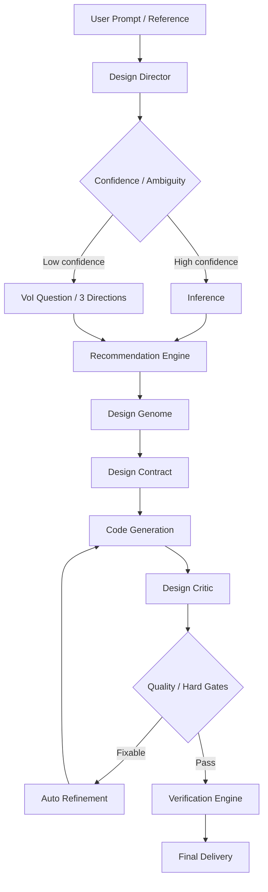

# Vibe UI V3 — Design Intelligence
## Final Product & Architecture Specification

> هدف این سند: تبدیل Vibe UI از یک مجموعه Skill و Style Catalog به یک **Design Decision Engine** که بتواند با یک prompt ساده، تصمیم‌های طراحی را خودش استخراج، پیشنهاد، ترکیب، نقد، اصلاح و verify کند؛ در حالی که کاربر حرفه‌ای بتواند کنترل دقیق را حفظ کند.

**Status:** Proposed Final Specification  
**Target:** V3 Design Intelligence  
**Date:** 2026-09-03  
**Source baseline:** `docs/ROADMAP_V3_DESIGN_INTELLIGENCE.md`

---

# 1. Product North Star

Vibe UI نباید کاربر را مجبور کند زبان تخصصی طراحی را بداند.

ورودی ایده‌آل:

> «برای یک کلینیک زیبایی، سایت مدرن و لوکس می‌خوام؛ حس اعتماد و آرامش بده و روی موبایل عالی باشه.»

خروجی مطلوب:

```text
Understand
→ Infer
→ Recommend
→ Compose
→ Generate
→ Critique
→ Refine
→ Verify
→ Deliver
```

معیار موفقیت، تعداد Styleها نیست.

معیار اصلی:

- کیفیت خروجی در اولین generation
- کاهش تعداد اصلاحات دستی
- تناسب Design با محصول و مخاطب
- تنوع واقعی خروجی‌ها
- حفظ کنترل برای کاربر حرفه‌ای
- قابل‌سنجش بودن کیفیت

# 2. Core Product Promise

V3 باید سه تجربه همزمان ارائه دهد.

## 2.1 Assisted Mode

کاربر فقط نیاز کسب‌وکار را بیان می‌کند.

سیستم:

1. intent را استخراج می‌کند.
2. domain و audience را infer می‌کند.
3. design direction را پیشنهاد می‌دهد.
4. فقط در صورت ambiguity معنی‌دار سؤال می‌پرسد.
5. design system را می‌سازد.
6. UI را تولید می‌کند.
7. خودش آن را نقد و اصلاح می‌کند.
8. سپس verification انجام می‌دهد.

## 2.2 Expert Mode

کاربر می‌تواند مستقیماً مشخص کند:

- style
- font
- palette
- layout
- density
- motion
- radius
- brand rules
- platform
- constraints

در این حالت سیستم نباید تصمیم‌های صریح کاربر را بی‌دلیل override کند.

## 2.3 Reference / Brand Mode

کاربر می‌تواند:

- design موجود
- screenshot
- brand guideline
- logo
- color
- existing UI

را به‌عنوان reference وارد کند.

سیستم باید **principle extraction** انجام دهد، نه clone کردن.

# 3. V3 System Architecture



اصل معماری:

> هیچ لایه‌ای نباید تصمیمی را که توسط یک لایه authoritative بالاتر گرفته بدون دلیل معتبر بازنویسی کند.

# 4. Design Decision Pipeline

## Stage A — Intent Extraction

خروجی:

```json
{
  "product_domain": "...",
  "primary_audience": "...",
  "product_mode": "...",
  "business_goal": "...",
  "tone": ["..."],
  "trust_requirement": "...",
  "visual_energy": "...",
  "density": "...",
  "platform": ["..."],
  "constraints": []
}
```

## Stage B — Confidence Estimation

هر inference باید confidence داشته باشد.

```text
0.80–1.00 → Auto decide
0.50–0.79 → Decide + expose alternatives
< 0.50    → Ask one high-value question
```

Confidence باید برای تصمیم‌های مهم جداگانه ثبت شود:

- domain
- audience
- product mode
- tone
- style
- typography
- palette
- layout

## Stage C — Candidate Generation

Recommendation Engine چند Design Direction تولید می‌کند.

هر candidate شامل:

```text
name
human-readable description
score
confidence
pros
risks
style family
mood
density
product mode
domain fit
```

## Stage D — Candidate Selection

انتخاب می‌تواند:

- خودکار
- توسط کاربر
- یا hybrid

باشد.

# 5. Value of Information (VoI)

سیستم نباید کاربر را با پرسش‌های تخصصی خسته کند.

قواعد:

### Low ambiguity
هیچ سؤال اضافی پرسیده نشود.

### Medium ambiguity
سیستم بهترین گزینه را انتخاب کند و امکان override بدهد.

### High ambiguity
فقط یکی از این دو:

1. یک سؤال با بیشترین ارزش اطلاعاتی
2. سه Design Direction با زبان انسانی

کاربر نباید مجبور باشد واژه‌هایی مثل OKLCH، Bento، Swiss Grid یا Neobrutalism را بشناسد.

# 6. Recommendation Engine

Recommendation Engine نباید صرفاً lookup table باشد.

برای هر candidate باید scoring انجام شود.

## Candidate Score

```text
Score =
  Domain Fit
+ Audience Fit
+ Product Mode Fit
+ Brand Fit
+ Content Fit
+ Platform Fit
+ Accessibility Fit
+ Performance Fit
+ Distinctiveness Fit
- Anti-pattern Penalty
- Compatibility Penalty
```

وزن‌ها باید قابل تنظیم باشند.

خروجی نمونه:

```json
{
  "candidate": "Editorial Premium",
  "score": 0.89,
  "confidence": 0.92,
  "reasons": [
    "High trust requirement",
    "Premium audience",
    "Calm visual energy",
    "Strong mobile typography"
  ],
  "risks": [
    "May feel too formal for young consumer brands"
  ]
}
```

# 7. Hard Constraints vs Soft Preferences

## Hard Constraints

مواردی که نباید شکسته شوند:

- accessibility requirements
- explicit brand colors
- required platform
- required language
- legal constraints
- explicit user requirements
- technical limitations

## Soft Preferences

مواردی که قابل compromise هستند:

- style preference
- mood
- density
- decorative effects
- novelty
- animation intensity

در conflict:

```text
Hard Constraint > Soft Preference
```

اما سیستم باید conflict را ثبت و توضیح دهد.

# 8. Decision Trace

تمام تصمیم‌های مهم باید قابل توضیح باشند.

```json
{
  "decision": "style",
  "selected": "Quiet Humanist",
  "score": 0.89,
  "alternatives": [
    {"id": "editorial", "score": 0.83},
    {"id": "luxury", "score": 0.77}
  ],
  "reasons": [
    "Healthcare domain",
    "High trust",
    "Calm tone",
    "Mobile-first"
  ]
}
```

هدف Decision Trace:

- debugging
- user trust
- critic feedback
- reproducibility
- benchmark analysis
- future learning

# 9. Design Genome

Genome نباید فقط Style باشد.

مدل پیشنهادی:

```text
Style
× Mood
× Domain
× Audience
× Product Mode
× Density
× Typography
× Color
× Layout
× Radius
× Depth
× Motion
× Texture
× Iconography
× Interaction
× Content Tone
× Platform
```

Genome باید **composable** باشد.

مثال:

```text
Editorial
+
Quiet Luxury
+
Data Dense
```

می‌تواند یک design direction معتبر بسازد بدون اینکه لازم باشد یک style جدید دائمی برای آن ایجاد شود.

# 10. Style Taxonomy

Styleها باید به خانواده‌های قابل تشخیص تقسیم شوند.

## Core

- Minimal
- Swiss / International
- Editorial
- Modern Corporate
- Flat
- Material
- Geometric

## Distinctive

- Neo-Brutalist
- Brutalist
- Organic / Humanist
- Quiet Luxury
- Tactile
- Skeuomorphic
- Art Deco
- Retro

## Digital / Experimental

- Bento
- Glass
- Soft UI
- Dark Editorial
- Futuristic
- Spatial
- Experimental

## Specialized

- Data-Dense
- Developer / Technical
- Commerce
- Healthcare
- Civic / Government

هدف اولیه:

> حدود 24–40 خانواده‌ی واقعاً متمایز، نه ده‌ها skin مشابه.

# 11. Style Acceptance Rule

Style جدید فقط زمانی اضافه شود که یکی از این‌ها را به‌طور معنی‌دار توسعه دهد:

- geometry
- layout
- typography
- density
- interaction
- motion
- content presentation

تغییر صرفاً رنگی یا shadow variation نباید Style Family جدید محسوب شود.

# 12. Domain Intelligence

Domain باید فقط tag نباشد؛ باید **design priors** داشته باشد.

نمونه:

```text
Fintech
  trust > novelty
  clarity > decoration

Healthcare
  clarity + serenity > decoration

Trading / DevOps
  efficiency + density > marketing

Creative / Fashion
  brand distinction > standardization

E-commerce
  conversion clarity > experimental interaction
```

این‌ها policyهای پیش‌فرض‌اند، نه قوانین مطلق.

کاربر و brand constraint می‌تواند آن‌ها را override کند.

# 13. Typography Intelligence

Typography باید از style جدا و در عین حال قابل ترکیب باشد.

سیستم باید تصمیم بگیرد:

- font family
- font pairing
- display/body relationship
- scale
- weight
- line height
- language coverage
- fallback
- readability

برای bilingual UI، Persian و Latin باید به‌صورت یک سیستم typography واحد ارزیابی شوند.

# 14. Color Intelligence

Color Engine مسئول:

- palette generation
- semantic roles
- accent
- surfaces
- text hierarchy
- dark mode
- light mode
- states
- contrast

است.

```text
Brand color
≠
Primary action color
≠
Decorative accent
```

و سیستم باید در صورت conflict، accessibility را بر سلیقه مقدم کند.

# 15. Layout Intelligence

Layout Engine باید تصمیم بگیرد:

- grid
- columns
- container
- whitespace
- alignment
- hierarchy
- asymmetry
- density
- responsive transformation

Responsive نباید صرفاً breakpoint switching باشد.

هدف:

> **Responsive Information Architecture**

# 16. State & Interaction Intelligence

هیچ component مهمی فقط یک state ندارد.

حداقل:

```text
default
hover
focus
active
disabled
loading
success
error
empty
offline
permission
validation
streaming
```

الگوهای interaction:

- modal
- drawer
- popover
- menu
- tabs
- search
- filter
- forms
- tables
- navigation
- multi-step flows

# 17. Responsive & Platform Intelligence

سیستم باید capability-based تصمیم بگیرد:

```text
mobile
 tablet
 desktop

touch
pointer
keyboard

RTL
LTR

reduced motion
```

هر platform باید بتواند composition و interaction را تغییر دهد، نه فقط اندازه‌ی component را.

# 18. Design Critic

Design Critic باید style-aware باشد.

معیارهای پایه:

```text
Visual Hierarchy
Composition
Spacing Rhythm
Typography
Color Hierarchy
Distinctiveness
Domain Fit
Brand Coherence
State Completeness
Responsive Integrity
Interaction Quality
Accessibility
Motion
Performance
Genericity / AI Slop
```

خروجی:

```text
score
violations
severity
evidence
suggested fix
```

# 19. Hard Gates vs Quality Score

این دو مفهوم باید مستقل باشند.

## Hard Gates

مثلاً:

```text
Build FAIL → Reject
Accessibility critical FAIL → Reject
Keyboard critical FAIL → Reject
Schema FAIL → Reject
```

## Quality Score

بعد از گذر از Hard Gates، Visual، Originality، Domain Fit، Typography، Composition و ... امتیاز می‌گیرند.

# 20. Auto-Refinement

چرخه:

```text
Generate
→ Critique
→ Rank Problems
→ Apply Highest-Impact Fix
→ Re-render
→ Re-evaluate
```

حداکثر 2–3 iteration.

Refinement نباید regeneration کور باشد.

هر iteration باید:

- علت مشخص
- patch محدود
- regression check

داشته باشد.

# 21. Visual Verification

Verification باید شامل:

- viewport matrix
- screenshot baseline
- visual diff
- typography check
- layout overflow
- spacing
- state rendering
- RTL/LTR

باشد.

حداقل viewportها:

```text
320
375
768
1024
1440
```

# 22. Accessibility Verification

ترکیب پیشنهادی:

```text
Standard JSON/schema validation
+
axe-core
+
Accessibility Tree
+
Keyboard E2E
+
Custom project invariants
```

هیچ heuristic منفردی نباید به‌عنوان «100% WCAG verified» معرفی شود.

# 23. Performance Verification

حداقل:

- LCP
- CLS
- INP
- Long Tasks
- Layout Shifts
- image/asset cost
- animation cost

Static heuristics فقط signal کمکی هستند.

# 24. Reference / Brand Analysis

اگر reference داده شده:

```text
Reference
→ Extract Principles
→ Generate
→ Compare Principles
→ Critique
```

نباید screenshot clone شود.

# 25. Benchmark System

Benchmark از روز اول V3 فعال باشد.

Dataset حداقل 100–500 prompt با تنوع در:

- domains
- product modes
- short/long prompts
- Persian/English/bilingual
- mobile/desktop
- ambiguous/explicit
- style-constrained
- brand-constrained

باشد.

# 26. Baseline Comparison

V3 باید با V2 مقایسه شود.

```text
V2
vs
V3
```

معیارها:

- First-Pass Quality
- Iteration Count
- User Effort
- Human Preference
- Accessibility
- Visual Diversity
- Domain Fit

# 27. User Effort KPI

اندازه‌گیری:

```text
Correction Count
Correction Tokens
Manual Overrides
Time to Accept
Number of Regenerations
```

هدف:

> کاربر نباید تبدیل به QA designer سیستم شود.

# 28. Human Evaluation

برای بخشی از benchmark، designerهای مستقل باید خروجی‌ها را blind-rate کنند.

ابعاد:

```text
Visual Quality
Originality
Product Fit
Usability
Brand Fit
Professionalism
```

Human score باید با automated score مقایسه شود.

# 29. Learning / Feedback Loop

```text
User Outcome
→ Feedback
→ Benchmark Dataset
→ Failure Analysis
→ Knowledge Update
→ Recommendation Update
```

feedback نباید بدون review مستقیماً policy را تغییر دهد.

# 30. Data Architecture

```text
data/
  taxonomy/
  styles/
  domains/
  typography/
  palettes/
  layouts/
  patterns/
  states/
  anti-patterns/
  compatibility/
```

Python، TypeScript، CLI، VS Code و evaluator باید همین داده‌ها را مصرف کنند.

# 31. Contract Architecture

سه نوع contract داشته باشید:

## Design Intent Contract
آنچه کاربر می‌خواهد.

## Design Decision Contract
تصمیمی که سیستم گرفته.

## Verification Contract
آنچه برای acceptance باید پاس شود.

این سه نباید با هم قاطی شوند.

# 32. Release / Versioning Rules

هر نسخه باید از یک source مرکزی مشتق شود.

```text
release manifest
├── repository version
├── schema version
├── CLI version
├── package versions
├── extension version
└── starter version
```

CI باید version drift را fail کند.

# 33. Security / Supply Chain

```text
Build
→ Artifact
→ SHA-256
→ Signature / Provenance
→ Verify
→ Publish
```

Installer باید verify، temp extract، validate، atomic install و rollback را پشتیبانی کند.

# 34. Execution Phases

## Phase 0 — Product Definition
هدف، کاربران، KPIها و baseline.

## Phase 1 — Foundation Hardening
schema، contracts، versioning، package isolation، CI.

## Phase 2 — Design Intelligence Contract
Intent Contract، Decision Contract، Verification Contract.

## Phase 3 — Design Director
inference، confidence، VoI، candidate directions.

## Phase 4 — Knowledge Base & Taxonomy
styles، domains، typography، palette، layout، states.

## Phase 5 — Recommendation Engine
scoring، priors، compatibility، explanation.

## Phase 6 — Design Genome
composition، constraints، overrides، hybrid styles.

## Phase 7 — Generation Intelligence
multi-skill generation بر اساس Design Contract.

## Phase 8 — Design Critic
heuristics، evidence، severity، style awareness.

## Phase 9 — Auto-Refinement
surgical fixes، bounded iterations، regression protection.

## Phase 10 — Verification 2.0
schema، browser، accessibility، responsive، RTL.

## Phase 11 — Visual & Performance
visual regression، Core Web Vitals، runtime evidence.

## Phase 12 — Style Universe Expansion
گسترش خانواده‌های style بر اساس gapهای benchmark.

## Phase 13 — Benchmark & Human Evaluation
100–500 prompts، V2 baseline، human scoring.

## Phase 14 — Unified Orchestrator
اتصال تمام مراحل به یک pipeline واحد.

## Phase 15 — Developer Experience
CLI، VS Code، reports، debugging، overrides.

## Phase 16 — Security & Release
signed artifacts، reproducible builds، installer hardening.

## Phase 17 — Production Validation
end-to-end audit، KPI verification، regression suite.

## Phase 18 — Continuous Design Intelligence
feedback، learning، taxonomy evolution.

# 35. Definition of Done for V3

## User Experience

- کاربر عادی با یک prompt ساده بتواند شروع کند.
- کاربر حرفه‌ای کنترل کامل داشته باشد.
- سیستم حداکثر یک سؤال high-value در حالت ambiguity بپرسد.
- توضیح تصمیم‌های اصلی قابل مشاهده باشد.

## Design Intelligence

- domain inference
- audience inference
- product mode
- style recommendation
- typography recommendation
- color recommendation
- layout recommendation
- density recommendation

وجود داشته باشند.

## Generation

- Design Contract تولید شود.
- Generator بر اساس Contract کار کند.
- style composition پشتیبانی شود.

## Critic / Refinement

- خروجی قبل از تحویل critic شود.
- مشکلات severity داشته باشند.
- حداکثر 2–3 refinement انجام شود.
- refinement باعث regression نشود.

## Verification

- schema gate
- accessibility gate
- keyboard gate
- responsive gate
- RTL gate
- visual regression
- performance checks

## Evidence

هر PASS مهم باید evidence قابل ردیابی داشته باشد.

# 36. V3 Success Criteria

## Primary KPIs

### First-Pass Quality
> 70%+

### User Correction Count
> average < 2

### Time to Accept
کاهش معنی‌دار نسبت به V2

### Human Preference
V3 باید در blind evaluation از V2 بهتر باشد.

### Visual Diversity
برای promptهای متفاوت، خروجی‌ها نباید صرفاً theme variation باشند.

### Domain Fit
انتخاب design direction باید با context محصول هم‌راستا باشد.

# 37. چیزهایی که V3 نباید انجام دهد

- اضافه کردن style صرفاً برای افزایش count
- پرسیدن سؤال‌های فنی از user عادی
- hardcode کردن تمام تصمیم‌های طراحی در prompt
- استفاده از score واحد برای همه چیز
- ادعای WCAG verification بر اساس heuristic محدود
- regeneration کامل برای هر اصلاح کوچک
- override کردن brand constraints بدون دلیل
- ساختن databaseهای duplicate برای هر runtime
- وابسته کردن packageهای مستقل به starter/example
- release بدون version synchronization

# 38. Architectural Principle

اصل نهایی پروژه:

> **Vibe UI نباید به کاربر بگوید چگونه طراحی کند؛ باید بفهمد کاربر چه می‌خواهد، بهترین زبان طراحی را برای آن انتخاب کند، آن را به سیستم طراحی قابل اجرا تبدیل کند، نتیجه را خودش نقد کند و قبل از تحویل کیفیت را اثبات کند.**

در نتیجه:

```text
Prompt
   ↓
Intent
   ↓
Inference
   ↓
Recommendation
   ↓
Design Genome
   ↓
Design Contract
   ↓
Generation
   ↓
Critique
   ↓
Refinement
   ↓
Verification
   ↓
Evidence-backed Delivery
```

این pipeline هسته Vibe UI V3 است.

# 39. Final Direction

پروژه نباید با هدف:

> «داشتن بیشترین تعداد Style»

رقابت کند.

باید با هدف:

> **«تولید بهترین Design Decision با کمترین دخالت کاربر»**

رقابت کند.

Style Library فقط یکی از منابع این تصمیم است.

# 40. Recommended Repository Structure for V3

```text
docs/
  V3_PRODUCT_VISION.md
  V3_ARCHITECTURE.md
  V3_DESIGN_INTELLIGENCE_SPEC.md
  V3_EVALUATION_SPEC.md
  V3_ROADMAP.md

data/
  taxonomy/
  styles/
  domains/
  typography/
  palettes/
  layouts/
  patterns/
  states/
  anti-patterns/

skills/
  design-director/
  recommendation-engine/
  design-genome/
  design-critic/
  auto-refiner/
  ui-verifier/

packages/
  design-contract/
  design-intelligence/
  verifier/
  cli/
  vscode/

evals/
  benchmark/
  fixtures/
  visual/
  accessibility/
  performance/
```

# Final Verdict

این specification باید جایگزین یک roadmap صرفاً feature-oriented شود.

تمرکز V3:

**Design Intelligence > Style Count**  
**Decision Quality > Prompt Complexity**  
**First-Pass Quality > Manual Iteration**  
**Evidence > Claims**  
**Composable System > Static Catalog**  
**User Intent > Design Jargon**

این تغییر جهت، Vibe UI را از یک collection of UI skills به یک **AI-assisted design decision and verification platform** تبدیل می‌کند.

---

# 41. پیوست مهندسی: حل قطعی ۷ مجهول کلیدی و گره‌های فنی (Resolution of 7 Core Unknowns)

برای به صفر رساندن آزمون‌وخطا در حین اجرا، تمام مجهولات احتمالی شناسایی و با راهکار قطعی مهندسی بسته شدند:

### ۱. مجهول سازگاری با گذشته (Backward Compatibility)
* **گره:** آیا ارتقای اسکیما و معرفی سبک‌های جدید، باعث شکسته شدن بیلدها، تست‌های ریاضی قبلی یا اگزمپل‌های موجود می‌شود؟
* **پاسخ قطعی:** خیر. ارتقا به صورت **سازگار افزایشی (Additive Extension)** انجام می‌شود:
  - مقادیر ۵ سبک قبلی در اسکیما حفظ شده و مقادیر جدید به آن اضافه می‌شوند.
  - فیلدهای جدید (`candidate_directions`, `style_genome`, `state_matrix`) به صورت اختیاری (`optional`) تعریف می‌شوند تا تست‌های قبلی همچنان با کد خروج ۰ پاس شوند.

### ۲. پردازش زبان طبیعی و تطبیق دامین با مدل اطمینان (Bilingual NLP & No Silent Fallbacks)
* در `taxonomy.json` برای هر دامین ده‌ها تگ و مترادف دوزبانه تعریف شده و حروف نرمالایز می‌شوند.
* **جلوگیری از خطای پنهان:** اگر ضریب اطمینان زیر ۰.۵۰ باشد، سیستم هرگز به صورت خاموش (Silently) به دامین دیگر تغییر جهت نمی‌دهد؛ بلکه با اعلام سطح اطمینان، پروتکل ۳ کاندیدا یا ۱ سوال باارزش (VoI) را فعال می‌کند. دامین عمومی صرفاً در صورتی استفاده می‌شود که کاربر صراحتاً بگوید: «تصمیم را به خودت می‌سپارم».

### ۳. لود پایدار فونت‌ها و جبران شیفت چیدمان (Font Metric Compensation & CLS Prevention)
* استفاده از فونت استاندارد **وزیرمتن (Vazirmatn)** از CDN جهانی Google Fonts.
* برای جلوگیری از پرش و شیفت لایه‌بندی در قطع اینترنت یا تاخیر لود (FOIT/FOUT)، فونت‌های پشتیبان سیستمی با ویژگی‌های جبران متریک فونت (`font-display: swap`, `size-adjust`) تنظیم می‌شوند تا شاخص Cumulative Layout Shift همواره زیر ۰.۱ ($CLS < 0.1$) باقی بماند.

### ۴. منتقد طراحی سبک‌آگاه (Style-Aware Critic)
* خط‌کش نقد برای هر سبک مجزاست؛ مثلاً سایه سخت مشکی در نئوبروتالیسم مجاز است، اما در سوئیسی خطا محسوب می‌شود.

### ۵. اشتراک داده بین پایتون، نود و اکستنشن (Single Source of Truth)
* داده‌ها در قالب فایل‌های JSON استاندارد در پوشه `data/` ذخیره می‌شوند و مستقیماً توسط پایتون، تایپ‌اسکریپت، CLI و اکستنشن بدون تبدیل کدهای موازی خوانده می‌شوند.

### ۶. اصلاح خودکار اولویت‌بندی شده و مهار رگرسیون (Priority Refinement & Anti-Regression)
* سقف تکرار: حداکثر ۲ دور. هر پچ اصلاحی صرفاً روی بزرگ‌ترین نقص شناسایی‌شده (از صف اولویت: بحرانی ➔ ظاهر ➔ کاربردپذیری) متمرکز می‌شود.
* **تست ضد رگرسیون:** بعد از اعمال هر پچ، تمام گیت‌های سخت (Hard Gates) مجدداً ارزیابی می‌شوند تا اطمینان حاصل شود اصلاح یک نقص ظاهری، منجر به افت کنتراست یا خرابی کیبورد نشده است.

### ۷. پرامپت کوتاه در برابر بلند (Assisted vs. Expert Mode)
* کاربر عادی با پرامپت یک‌خطی ۳ مسیر ملموس دریافت می‌کند؛ کاربر حرفه‌ای با پرامپت تخصصی، تنظیمات خود را بدون مداخله دریافت می‌کند.
