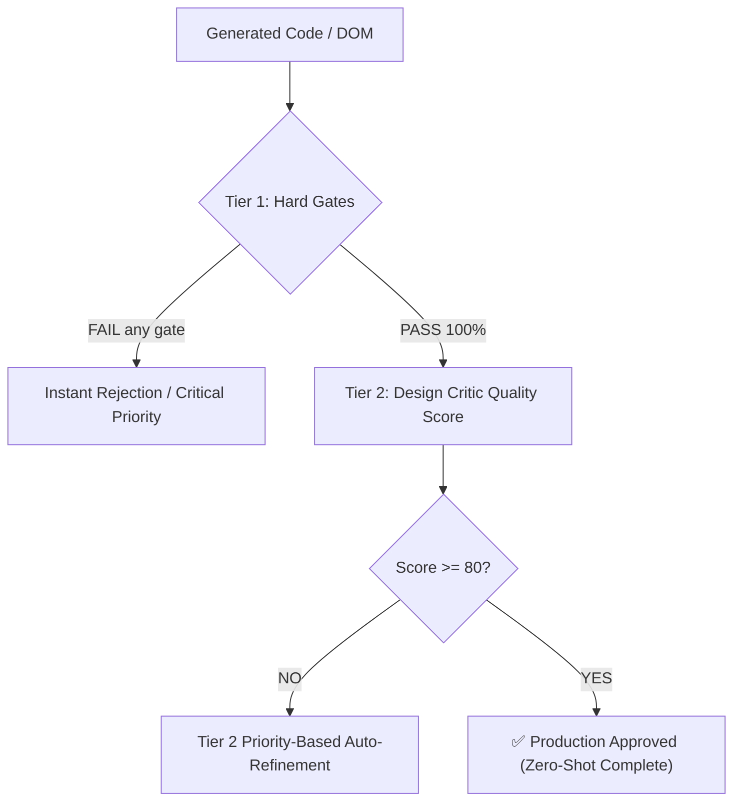

# 📊 Vibe UI v3: Evaluation, Quality Gates & Benchmark Specification
## Two-Tier Quality Gates, Priority-Based Refinement, User-Effort KPIs & Stratified Baseline

---

## ۱. ساختار دو لایه‌ای پذیرش کیفیت (Two-Tier Quality Gates)

کیفیت یک رابط کاربری نباید صرفاً با یک نمره میانگین سنجیده شود. یک رابط نمی‌تواند نمره ۹۵ بگیرد در حالی که کیبورد نویگیشن آن خراب است!  
بنابراین پذیرش نهایی به صورت یک معادله منطقی دو لایه‌ای تعریف می‌شود:

$$\text{Final Acceptance} = \mathbf{HardGates} \land (\text{QualityScore} \ge 80)$$

### سطح ۱: گیت‌های سخت و غیرقابل‌مذاکره (Tier 1: Hard Gates - Pass/Fail)
1. **WCAG 2.2 AA Contrast Gate:** نسبت کنتراست متن بدنه $\ge 4.5:1$ و تیترها $\ge 3.0:1$ در تمام حالات (Hover, Focus, Default).
2. **Mobile Layout Integrity Gate:** صفر درصد اورفلو افقی در عرض‌های ۳۲۰px و ۳۷۵px.
3. **Keyboard & Focus Ring Gate:** تمام المان‌های کلیک‌پذیر باید استایل مشخص `:focus-visible` داشته باشند.
4. **Accessible Label Gate:** تمام دکمه‌ها، آیکون‌ها و اینپوت‌ها باید `aria-label` یا عنوان متنی غیرخالی داشته باشند.
5. **Reduced Motion Gate:** غیرفعال شدن تمام انیمیشن‌های طولانی در حالت `prefers-reduced-motion: reduce`.
6. **Zero Raw Emojis Gate:** استفاده از آیکون‌های برداری SVG خالص به جای ایموجی‌های یونیکد.

### سطح ۲: نمره کیفی منتقد طراحی (Tier 2: Design Critic Quality Score - 0 to 100)
* **جریمه یکنواختی و کلیشه (Genericity Penalty):** تنوع در چیدمان کارت‌ها و تفاوت در ریتم بصری (سقف ۳۰ نمره).
* **سلسله‌مراتب اسکن بصری (Scan Hierarchy):** وضوح جریان دیداری (F-Pattern یا Z-Pattern) و داشتن یک دکمه اصلی متمایز (سقف ۲۵ نمره).
* **تناسب سبک با دامین (Domain Appropriateness):** انطباق دقیق با ماهیت محصول (سقف ۲۵ نمره).
* **کامل بودن حالات (State Completeness):** داشتن لودینگ اسکلتون و پیام خطا/خالی (سقف ۲۰ نمره).

---

## ۲. صف اولویت‌بندی اصلاح خودکار (Priority-Based Auto-Refinement)

وقتی کدی نیاز به اصلاح دارد، سیستم به صورت تصادفی دست به تغییرات نمی‌زند؛ بلکه اصلاحات را بر اساس یک صف اولویت‌بندی شده (Priority Queue) انجام می‌دهد:

1. **اولویت بحرانی (Critical Blockers):** رفع هرگونه شکستگی در Hard Gates (مثل رنگ ناخوانا یا اورفلو صفحه).
2. **اولویت بالا (High-Impact Visual):** شکستن الگوهای تکراری ۴ کارت مشابه و رفع گرادیان‌های کلیشه‌ای بنفش.
3. **اولویت متوسط (Usability / States):** تزریق اسکلتون لودینگ یا بهبود اندازه تاچ‌تارگت‌ها به ۴۴ پیکسل.
4. **اولویت پولیش (Aesthetic Polish):** بهبود فواصل (Whitespace) و ریتم متون.

*قانون تضمین سلامت پچ:* هر اصلاح خودکار موظف است مجدداً گیت‌های سخت را تست کند تا اصلاح یک عیب، عیب دیگری ایجاد نکند.

---

## ۳. شاخص‌های سنجش زحمت کاربر (User-Effort KPIs)

متر و معیار واقعی موفقیت Vibe UI این نیست که چند خط کد تولید شده؛ معیار این است که **طراح چقدر کمتر زحمت کشیده است:**

| شاخص کلیدی | تعریف عملیاتی | هدف استاندارد Vibe UI v3 | وضعیت فعلی مدل‌های خام |
| :--- | :--- | :--- | :--- |
| **First-Pass Success Rate** | درصد پروژه‌هایی که بدون حتی ۱ پرامپت اصلاحی پذیرفته می‌شوند | **$\ge 70\%$** | کمتر از ۱۵٪ |
| **Average Correction Prompts** | میانگین دفعاتی که کاربر مجبور به نوشتن «این رو عوض کن» می‌شود | **$< 1.5$ بار** | ۵ تا ۱۰ بار |
| **Correction Token Volume** | حجم توکن‌هایی که کاربر برای توضیح اشتباهات هوش مصنوعی مصرف می‌کند | **$< 150$ توکن** | بیش از ۱۵۰۰ توکن |
| **Time to Acceptable Result** | زمان رسیدن به طراحی قابل قبول در مرورگر | **زیر ۴۵ ثانیه** | ۱۰ تا ۱۵ دقیقه چت مداوم |

---

## ۴. بنچ‌مارک مقایسه‌ای دوگانه با مدل‌های خام (Stratified Baseline A/B)

برای اثبات علمی و عددی برتری سیستم، یک دیتاست آزمون طبقه‌بندی شده (Stratified Benchmark) شامل **۱۰۰ سناریوی استاندارد** طراحی می‌شود:
* ۲۰ دامین مختلف (فین‌تک، پزشکی، آموزش، املاک، ارز دیجیتال، مد، کافه، داکیومنت، ابزار ادمین...)
* ۴ حالت محصول (Persuade, Operate, Read, Experience)
* به دو زبان فارسی و انگلیسی
* با سطوح مختلف پیچیدگی پرامپت (پرامپت ۱ خطی عامیانه تا پرامپت چندخطی تخصصی)

### روش ارزیابی A/B:
برای تک‌تک ۱۰۰ سناریو، دو خروجی مقایسه می‌شوند:
* **خروجی A (Baseline):** اجرای مستقیم پرامپت با مدل خام (Claude Sonnet یا ChatGPT بدون مهارت Vibe UI).
* **خروجی B (Candidate):** اجرای پرامپت از طریق **Vibe UI v3 Architecture**.

نتیجه این آزمون به صورت یک گزارش شفاف و آماری منتشر خواهد شد تا پیشرفت پروژه کاملاً **تجربی، مستند و اثبات‌شده** باشد.
